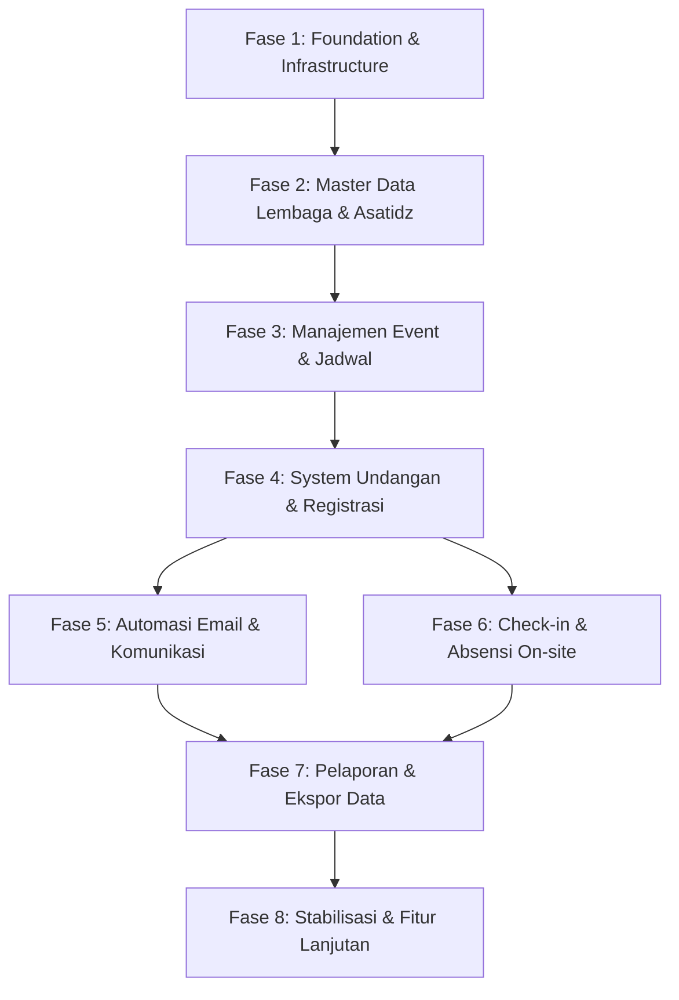

# Rencana Implementasi Teknis Sistem Informasi Daurah Asatidz YTS

## 1. Ringkasan Arsitektur Sistem

Sistem Informasi Daurah Asatidz YTS dibangun menggunakan arsitektur **Modular Monolith** dengan pemisahan batas (boundary) yang jelas antara frontend, backend serverless API, dan basis data PostgreSQL serverless.

### A. Komponen Utama
1. **Frontend Application**:
   - Single Page Application (SPA) berbasis React, TypeScript strict mode, Vite, dan `@refinedev/core@5.0.12`.
   - Mengelola 3 Portal (`/admin`, `/committee`, `/portal`) serta Halaman Publik (`/invitation/...`, `/events/:slug`, `/check-in/...`) dalam satu codebase.
   - Menggunakan design system shadcn/ui dan Tailwind CSS.
   - **Keamanan Client**: Browser **TIDAK PERNAH** menyimpan `DATABASE_URL` atau mengakses Neon PostgreSQL secara langsung. Seluruh komunikasi data melalui REST API backend.

2. **Backend Services (Netlify Functions)**:
   - REST API modular di `/netlify/functions/api.ts` yang menangani routing, autentikasi session, validasi input (Zod), dan otorisasi.
   - Menggunakan Drizzle ORM dengan `@neondatabase/serverless` HTTP driver (connection pooling).
   - Layanan khusus: Auth Service, RBAC Evaluator Engine, Audit Logger Service, Email Queue Worker, dan Check-in Processor.

3. **Database Layer (Neon PostgreSQL)**:
   - Satu basis data PostgreSQL serverless berisi 25 tabel entitas inti terstruktur.
   - Menerapkan constraint unik, foreign key, dan indeks performa untuk pencarian cepat.

4. **External Integrations**:
   - Transactional Email Provider (Resend/provider setara) dengan webhook event callback.
   - S3-Compatible Object Storage untuk dokumen dan foto profil.

---

## 2. Urutan Implementasi Teknis yang Aman

Urutan pengembangan dirancang secara bertahap (*dependency-aware*) untuk memastikan setiap modul bergantung pada komponen yang sudah teruji.

### Langkah Implementasi Per Fase:

#### Fase 1 — Foundation & Infrastructure
- Inisialisasi Vite + React + TypeScript strict.
- Setup Refine Core Data Provider, Auth Provider, dan Access Control Provider.
- Skema Drizzle ORM lengkap 25 tabel dan script migrasi/seed.
- Backend REST API Handler Netlify Functions + Correlation ID + Error Middleware.
- Engine Evaluasi RBAC (Global Role & Event-Scoped Role).
- Audit Logging Service dasar.

#### Fase 2 — Master Data (Lembaga & Asatidz)
- CRUD Master Data Lembaga & Manajemen Perwakilan Lembaga.
- CRUD Master Data Profil Ustadz & Tabel Afiliasi Lembaga (`ustadz_institution_affiliations`).
- Algoritma Pencarian & Matching Kandidat Profil Duplikat.
- Workflow Transaksional Merge Profil Ustadz Duplikat tanpa hard delete.

#### Fase 3 — Manajemen Event & Jadwal
- CRUD Event Multi-Hari dengan dukungan Timezone (`Asia/Jakarta`).
- Pengaturan Hari (`event_days`) dan Sesi (`event_sessions`).
- Penugasan Panitia Event (`event_committee_assignments`).
- State Transition Event (`DRAFT` -> `PUBLISHED` -> `REGISTRATION_OPEN` -> `REGISTRATION_CLOSED` -> `IN_PROGRESS` -> `COMPLETED` -> `ARCHIVED`).

#### Fase 4 — Undangan & Registrasi
- Pembuatan Undangan Lembaga & Undangan Individu.
- Penerbitan Link/Token Unik (128-bit entropy, hash storage).
- Form Publik Registrasi Perwakilan & Pengisian Delegasi Peserta.
- Transaksi Persetujuan Peserta (`approve`, `waitlist`, `decline`, `cancel`, `replace`).
- Enforcement Kuota Lembaga dan Kapasitas Event.

#### Fase 5 — Automasi Email & Notifikasi
- Template Engine Email dengan Whitelisted Variable.
- Database Queue Worker (`email_jobs` & `email_deliveries`) dengan Atomic Batch Locking.
- Webhook Handler Idempotent untuk Delivery/Bounce Tracking.
- Scheduled Cron Functions untuk Scheduled Reminders (H-7, H-3, H-1, Hari-H).

#### Fase 6 — Check-in & Absensi On-site
- Generator QR Peserta (Token Opaque tanpa PII).
- Scanner QR & Fallback Input Kode Registrasi pada Portal Panitia.
- Validation Pipeline Check-in (Cek Event, Status Participant, Window Time, Duplicate Scan Prevention).
- Absensi Harian & Absensi Per Sesi.
- Workflow Koreksi Kehadiran Manual dengan Alasan & Audit Log.

#### Fase 7 — Pelaporan, Ekspor, & Stabilisasi
- Dashboard Agregasi Real-time untuk Admin & Panitia.
- Pelaporan Rekap Lembaga, Peserta, Kehadiran, dan No-Show.
- Engine Ekspor Data (XLSX, CSV) dengan Permission Enforcement & Audit Log.
- Hardening Keamanan, Vulnerability Audit, dan Load Test.

---

## 3. Strategi Keamanan & Quality Gates

1. **Security Rules**:
   - Backend Authorization: Semua endpoint memeriksa permission code & event_id/institution_id scope.
   - Token Hash: Token undangan & QR token disimpan sebagai hash di database.
   - Rate Limiting & Captcha: Diterapkan pada form publik dan endpoint sensitif.

2. **Quality Gates (Definition of Done)**:
   - `npm run typecheck` (`tsc --noEmit`) lulus tanpa error.
   - Unit & Integration Test (`vitest`) lulus 100%.
   - Production build (`npm run build`) berhasil terkompilasi.
