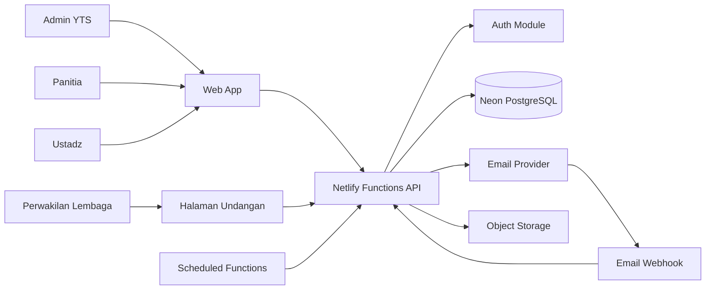

# Arsitektur Sistem

## 1. Gaya Arsitektur

MVP menggunakan **modular monolith**:

- Satu frontend React.
- Satu kelompok Netlify Functions.
- Satu database PostgreSQL.
- Modul dipisahkan secara logis.
- Tidak menggunakan microservices pada tahap awal.

Alasan:

- Tim lebih mudah mengembangkan dan mengoperasikan.
- Transaksi lintas modul lebih sederhana.
- Deployment lebih cepat.
- Biaya observability lebih rendah.
- Sistem masih dapat dipecah ketika kebutuhan nyata muncul.

## 2. Diagram Konteks



## 3. Tiga Portal dalam Satu Aplikasi

```text
/admin/*
/committee/*
/portal/*
```

Halaman publik:

```text
/invitation/institution/:token
/invitation/individual/:token
/events/:slug
/check-in/:eventSlug
```

Setiap route group memiliki:

- Layout.
- Navigasi.
- Permission.
- Error boundary.
- Loading state.
- Data precondition.

## 4. Modul Backend

```text
auth
users
roles
institutions
ustadz
affiliations
events
event-days
event-sessions
committees
invitations
representatives
participants
confirmations
announcements
email
checkin
attendance
reports
files
audit
system-settings
```

## 5. Layer Backend

### Handler

- Membaca request.
- Memeriksa authentication.
- Melakukan validasi awal.
- Memanggil service.
- Mengubah hasil menjadi response.

### Service

- Menjalankan business rule.
- Menentukan transaksi.
- Memeriksa state transition.
- Memanggil repository dan service eksternal.
- Menulis audit event.

### Repository

- Query database.
- Tidak mengandung aturan akses pengguna.
- Tidak memformat HTTP response.
- Menggunakan transaksi dari service bila diberikan.

### Integration

- Email provider.
- Object storage.
- QR utility.
- Captcha.
- Webhook verification.

## 6. Batas Transaksi

Transaksi wajib untuk operasi seperti:

- Membuat peserta dan mengurangi kuota.
- Mengganti peserta.
- Menyetujui peserta dan menerbitkan kode.
- Mencatat check-in dan audit log.
- Merge profil duplikat.
- Mengirim konfirmasi final lembaga.
- Memproses webhook email secara idempotent.

## 7. Data Ownership

| Data | Pemilik Logis |
|---|---|
| Profil lembaga | Modul institutions |
| Profil ustadz | Modul ustadz |
| Afiliasi | Modul affiliations |
| Event dan jadwal | Modul events |
| Undangan | Modul invitations |
| Peserta event | Modul participants |
| Kehadiran | Modul attendance |
| Pengiriman email | Modul email |
| Jejak perubahan | Modul audit |

## 8. State Transition

Perubahan status dilakukan melalui command/service, bukan update generik.

Contoh:

```text
submitInstitutionInvitation()
approveParticipant()
waitlistParticipant()
cancelParticipant()
replaceParticipant()
openEventRegistration()
closeEventRegistration()
startEvent()
completeEvent()
recordAttendance()
correctAttendance()
```

## 9. Event Scope

Setiap resource event-scoped memiliki `event_id`.

Akses backend:

```text
authenticate
-> resolve roles
-> resolve event assignments
-> authorize action and event_id
-> execute service
```

Super admin boleh lintas event. Role lainnya hanya pada assignment yang aktif.

## 10. Antrean Email

Database-backed queue untuk MVP:

```text
email_jobs
  status: QUEUED | PROCESSING | SENT | FAILED | CANCELLED
  scheduled_at
  locked_at
  locked_by
  attempt_count
  max_attempts
  idempotency_key
```

Scheduled Function:

1. Mencari job yang jatuh tempo.
2. Mengunci batch secara aman.
3. Menyerahkan batch pada worker.
4. Worker mengirim dan menyimpan provider ID.
5. Webhook memperbarui delivery status.

## 11. Observability

Minimal:

- Correlation ID per request.
- Structured log JSON.
- Error category.
- User ID bila tersedia.
- Event ID bila tersedia.
- Duration.
- Database error tanpa membocorkan credential.
- Email provider message ID.
- Check-in result.

## 12. Kinerja

Target awal:

- Halaman utama portal: p95 < 2,5 detik pada koneksi seluler wajar.
- Search peserta on-site: respons p95 < 700 ms.
- Check-in: respons p95 < 1,5 detik.
- API list terpaginated.
- Export besar diproses asynchronous atau background.
- Dashboard agregasi berat menggunakan query yang dioptimalkan.

## 13. Ketahanan

- Idempotency pada check-in, email, dan webhook.
- Retry dengan exponential backoff.
- Unique constraint untuk mencegah duplikasi.
- Timeout untuk integrasi eksternal.
- Circuit-breaker sederhana bila provider email bermasalah.
- Graceful degradation: kegagalan email tidak membatalkan penyimpanan konfirmasi.
