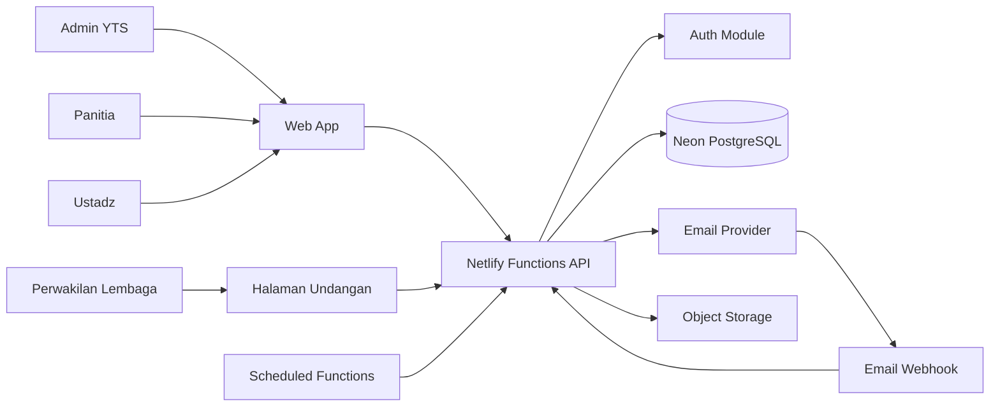

# Sistem Informasi Daurah Asatidz YTS — Dokumentasi Lengkap

> Dokumen gabungan. Untuk pengembangan aktif, gunakan file modular agar perubahan lebih mudah ditelusuri.


---


<!-- SOURCE: 00-README.md -->

# Dokumentasi Sistem Informasi Daurah Asatidz YTS

## Ringkasan

Repositori dokumentasi ini menjadi sumber acuan produk dan pengembangan **Sistem Informasi Daurah Asatidz Yayasan Tarbiyah Sunnah (YTS)**.

Sistem dirancang untuk mengelola:

- Multi-event atau multi-daurah.
- Undangan per lembaga dan per individu.
- Profil asatidz dan afiliasi lembaga.
- Pendaftaran ulang melalui tautan unik.
- Konfirmasi peserta.
- Jadwal kegiatan dan pengumuman.
- Email undangan, konfirmasi, reminder, dan ucapan terima kasih.
- Check-in menggunakan QR dan kode.
- Absensi per hari dan per sesi.
- Pelaporan kehadiran.
- Tiga portal: Admin, Panitia, dan Ustadz.

## Sasaran Utama

1. Menjadikan data asatidz dan lembaga sebagai master data berkelanjutan.
2. Menghilangkan pencatatan berulang untuk setiap daurah.
3. Memisahkan data undangan, konfirmasi, persetujuan, dan kehadiran.
4. Memudahkan panitia bekerja sebelum, saat, dan setelah daurah.
5. Menjadi fondasi CRM jejaring asatidz dan lembaga YTS.

## Stack Utama

- React + TypeScript.
- Vite.
- `@refinedev/core@5.0.12`.
- shadcn/ui.
- BeUI dan Hallmark sebagai sumber pola visual/komponen terpilih.
- Tailwind CSS.
- Neon PostgreSQL.
- Drizzle ORM.
- Netlify.
- Netlify Functions.
- Penyedia autentikasi berbasis PostgreSQL.
- Penyedia transactional email.
- Object storage S3-compatible.

> Nama paket, repository, lisensi, dan kompatibilitas BeUI serta Hallmark wajib diverifikasi dan dicatat di `02-STACK.md` sebelum dependensi dipasang.

## Daftar Dokumen

| File | Tujuan |
|---|---|
| `01-PRD.md` | Kebutuhan produk dan proses bisnis |
| `02-STACK.md` | Keputusan teknologi dan aturan dependensi |
| `03-SYSTEM_ARCHITECTURE.md` | Arsitektur aplikasi dan batas layanan |
| `04-DATABASE_SCHEMA.md` | Entitas, relasi, constraint, dan indeks |
| `05-RBAC_ACCESS_CONTROL.md` | Role, permission, dan event scope |
| `06-API_SPEC.md` | Konvensi serta rancangan endpoint API |
| `07-EMAIL_AUTOMATION.md` | Email, reminder, queue, dan webhook |
| `08-CHECKIN_ATTENDANCE.md` | QR, kode, check-in, dan absensi |
| `09-UI_UX_GUIDE.md` | Navigasi dan standar pengalaman pengguna |
| `10-SECURITY_PRIVACY.md` | Keamanan, privasi, audit, dan retensi |
| `11-ROADMAP.md` | Tahapan implementasi |
| `12-ACCEPTANCE_CRITERIA.md` | Kriteria penerimaan fitur |
| `13-DEPLOYMENT_OPERATIONS.md` | Environment, deployment, dan operasional |
| `14-AGENTS.md` | Aturan untuk coding agent |
| `15-PROMPT_LOG.md` | Log instruksi yang diberikan kepada AI |
| `16-DECISION_LOG.md` | Catatan keputusan arsitektur dan produk |
| `17-TEST_PLAN.md` | Strategi pengujian |
| `18-SEED_DATA.md` | Data awal untuk development dan demo |
| `ALL-IN-ONE.md` | Gabungan seluruh dokumen |

## Urutan Baca untuk Developer

1. `01-PRD.md`
2. `03-SYSTEM_ARCHITECTURE.md`
3. `04-DATABASE_SCHEMA.md`
4. `05-RBAC_ACCESS_CONTROL.md`
5. `06-API_SPEC.md`
6. Dokumen modul terkait pekerjaan yang sedang dikerjakan.
7. `12-ACCEPTANCE_CRITERIA.md`
8. `17-TEST_PLAN.md`

## Urutan Implementasi Singkat

1. Bootstrap proyek dan design system.
2. Database, migration, authentication, RBAC, dan audit log.
3. Master data lembaga serta asatidz.
4. Event, hari, sesi, dan kepanitiaan.
5. Undangan lembaga dan individu.
6. Pendaftaran ulang, konfirmasi, dan persetujuan.
7. Email serta reminder.
8. Check-in dan absensi.
9. Dashboard, laporan, ekspor, dan stabilisasi.

## Prinsip Produk

> Bangun sederhana untuk daurah pertama, tetapi jangan membuat struktur data yang hanya dapat dipakai satu kali.

## Status Dokumen

- Versi: `0.1.0`
- Status: Draft implementasi awal
- Tanggal penyusunan: 30 Juli 2026
- Pemilik produk: Yayasan Tarbiyah Sunnah


---


<!-- SOURCE: 01-PRD.md -->

# Product Requirements Document

## 1. Identitas Produk

- **Nama kerja:** Sistem Informasi Daurah Asatidz YTS
- **Alternatif nama:** DaurahHub YTS
- **Jenis:** Web application responsif
- **Pemilik:** Yayasan Tarbiyah Sunnah
- **Pengguna utama:** Admin YTS, panitia, ustadz, dan perwakilan lembaga

## 2. Latar Belakang

Pengelolaan daurah asatidz melibatkan data lembaga, profil asatidz, undangan, peserta delegasi, konfirmasi, reminder, jadwal, check-in, dan absensi beberapa hari. Jika proses tersebut dilakukan melalui pesan, formulir umum, dan spreadsheet terpisah, maka akan muncul:

- Duplikasi profil ustadz.
- Sulit mengetahui respons setiap lembaga.
- Peserta lembaga berubah tanpa jejak.
- Status konfirmasi dianggap sama dengan kehadiran.
- Absensi daurah beberapa hari tidak akurat.
- Komunikasi dan reminder tidak terukur.
- Riwayat keterlibatan asatidz tidak tersimpan lintas kegiatan.
- Laporan harus dirapikan ulang secara manual.

## 3. Visi

Membangun pusat pengelolaan daurah dan jejaring asatidz yang akurat, aman, mudah digunakan, dan dapat dikembangkan menjadi CRM pembinaan asatidz dan lembaga dakwah YTS.

## 4. Tujuan Produk

1. Menyediakan master data asatidz dan lembaga.
2. Mengelola banyak daurah dalam satu sistem.
3. Mendukung undangan per lembaga dan individu.
4. Memberikan tautan unik per undangan.
5. Memungkinkan lembaga mendaftarkan delegasinya.
6. Memisahkan status undangan, konfirmasi, persetujuan, dan kehadiran.
7. Mengelola jadwal multi-hari dan multi-sesi.
8. Mempercepat check-in di lokasi.
9. Mengotomasi komunikasi email.
10. Menyediakan laporan lintas kegiatan.

## 5. Bukan Tujuan MVP

MVP belum mencakup:

- Pembayaran kegiatan.
- Hotel dan transportasi.
- Konsumsi terintegrasi.
- Sertifikat otomatis.
- WhatsApp gateway.
- Aplikasi mobile native.
- Learning management system.
- Streaming materi.
- Sistem multi-tenant komersial.

## 6. Persona

### 6.1 Super Admin YTS

Membuat event, mengelola master data, undangan, akses pengguna, laporan, konfigurasi, dan audit.

### 6.2 Admin Event

Mengelola satu atau beberapa event yang diberikan kepadanya.

### 6.3 Ketua Panitia

Mengawasi peserta, jadwal, informasi, check-in, dan pelaporan event tertentu.

### 6.4 Petugas Registrasi

Memindai QR, mencari peserta, memasukkan kode, dan melakukan koreksi terbatas.

### 6.5 Petugas Informasi

Mengelola jadwal dan pengumuman event tertentu.

### 6.6 Ustadz

Melihat undangan, memperbarui profil, melakukan konfirmasi, mengakses jadwal, QR, pengumuman, dan riwayat.

### 6.7 Perwakilan Lembaga

Menerima undangan lembaga, memverifikasi data lembaga, mengisi data perwakilan, dan mendaftarkan delegasi sesuai kuota.

## 7. Model Kegiatan

Nilai `audience_mode`:

- `INSTITUTION_INVITATION`
- `INDIVIDUAL_INVITATION`
- `OPEN_REGISTRATION`
- `HYBRID`

Nilai `attendance_mode`:

- `DAILY`
- `SESSION`
- `DAILY_AND_SESSION`
- `CHECKIN_CHECKOUT`

## 8. Alur Undangan Lembaga

1. Admin membuat event.
2. Admin memilih lembaga.
3. Admin menentukan kuota, PIC, batas konfirmasi, dan template.
4. Sistem membuat undangan serta token unik.
5. Email dikirim kepada perwakilan.
6. Perwakilan membuka tautan.
7. Perwakilan memverifikasi data lembaga.
8. Perwakilan mengisi data dirinya.
9. Perwakilan memilih respons lembaga.
10. Perwakilan menambahkan peserta.
11. Sistem mendeteksi kemungkinan profil duplikat.
12. Perwakilan menyimpan draft atau melakukan konfirmasi final.
13. Admin memeriksa peserta.
14. Peserta disetujui, ditolak, atau masuk daftar tunggu.
15. Peserta menerima email dan QR.
16. Reminder dikirim sesuai kondisi.
17. Kehadiran dicatat per hari atau sesi.
18. Ucapan terima kasih dikirim setelah hadir.

## 9. Alur Undangan Individu

1. Admin memilih profil ustadz.
2. Sistem membuat undangan individu.
3. Ustadz menerima email dan tautan unik.
4. Ustadz melakukan verifikasi.
5. Ustadz memperbarui profil jika diperlukan.
6. Ustadz memilih hadir atau tidak hadir.
7. Admin menyetujui sesuai aturan event.
8. QR dan informasi kegiatan diterbitkan.
9. Kehadiran tercatat saat pelaksanaan.

## 10. Modul Produk

### 10.1 Authentication

- Login Google.
- Magic link atau email OTP.
- Session berbasis secure cookie.
- Logout seluruh perangkat.
- Pemulihan akses.
- Optional MFA untuk admin.

### 10.2 Master Data Lembaga

- Profil lembaga.
- Kategori lembaga.
- Alamat dan wilayah.
- Kontak resmi.
- Status verifikasi.
- Perwakilan.
- Catatan internal.
- Riwayat undangan dan partisipasi.

### 10.3 Master Data Asatidz

- Profil utama.
- Kontak.
- Domisili.
- Pendidikan dan bidang keilmuan.
- Afiliasi satu atau beberapa lembaga.
- Lembaga utama.
- Riwayat event.
- Riwayat konfirmasi dan kehadiran.
- Proses merge data duplikat.

### 10.4 Event

- Identitas kegiatan.
- Deskripsi.
- Tanggal.
- Zona waktu.
- Lokasi dan maps.
- Kapasitas.
- Kuota default lembaga.
- Mode peserta.
- Mode absensi.
- Batas pendaftaran.
- Status.
- Dokumen dan informasi penting.

### 10.5 Hari dan Sesi

- Hari kegiatan.
- Sesi.
- Pemateri.
- Moderator.
- Ruangan.
- Jam mulai dan selesai.
- Sesi wajib atau opsional.
- Check-in diperlukan atau tidak.
- Jendela check-in.

### 10.6 Undangan

- Undangan lembaga.
- Undangan individu.
- Nomor undangan.
- Token unik.
- Batas respons.
- Kuota.
- Status delivery dan respons.
- Pengiriman ulang.
- Pencabutan tautan.

### 10.7 Registrasi dan Konfirmasi

- Simpan draft.
- Konfirmasi final.
- Persetujuan peserta.
- Daftar tunggu.
- Pembatalan.
- Penggantian peserta.
- Riwayat perubahan.
- Verifikasi email.

### 10.8 Komunikasi

- Template email.
- Pengumuman portal.
- Segmentasi penerima.
- Reminder otomatis.
- Notifikasi perubahan jadwal.
- Ucapan terima kasih.

### 10.9 Check-in dan Absensi

- QR peserta.
- QR lokasi dinamis.
- Kode peserta.
- Kode sesi.
- Pencarian manual.
- Pencegahan duplikasi.
- Koreksi dengan alasan.
- Audit log.
- Dashboard real-time.

### 10.10 Laporan

- Rekap lembaga.
- Rekap peserta.
- Respons undangan.
- Kehadiran per hari.
- Kehadiran per sesi.
- No-show.
- Peserta berulang.
- Sebaran wilayah.
- Ekspor XLSX, CSV, dan print-friendly.

## 11. Status Utama

### Event

`DRAFT`, `PUBLISHED`, `REGISTRATION_OPEN`, `REGISTRATION_CLOSED`, `IN_PROGRESS`, `COMPLETED`, `CANCELLED`, `ARCHIVED`

### Invitation

`DRAFT`, `SCHEDULED`, `SENT`, `DELIVERED`, `OPENED`, `RESPONDED`, `EXPIRED`, `BOUNCED`, `REVOKED`

### Participant

`INVITED`, `DRAFT`, `SUBMITTED`, `PENDING_REVIEW`, `APPROVED`, `WAITLISTED`, `CONFIRMED`, `DECLINED`, `CANCELLED`, `REPLACED`

### Attendance

`NOT_CHECKED_IN`, `PRESENT`, `LATE`, `EXCUSED`, `ABSENT`, `CHECKED_OUT`, `MANUALLY_CORRECTED`

## 12. Aturan Bisnis Penting

1. Profil ustadz tidak dibuat ulang per event.
2. Afiliasi ustadz dan lembaga menggunakan tabel relasi.
3. Konfirmasi tidak otomatis berarti hadir.
4. Kehadiran dicatat per event day atau event session.
5. Link undangan lembaga hanya dapat mengelola lembaga pada undangan tersebut.
6. Kuota tidak dapat dilampaui tanpa override admin.
7. Penggantian peserta tidak menghapus riwayat peserta lama.
8. Koreksi kehadiran wajib memiliki alasan.
9. Semua endpoint sensitif memeriksa role dan event scope.
10. Status derived tidak diedit langsung jika dapat dihitung dari data sumber.
11. Email job harus idempotent.
12. QR peserta tidak memuat data pribadi terbuka.
13. Token asli tidak disimpan dalam database.
14. Perubahan jadwal yang sudah dipublikasikan dapat memicu notifikasi.
15. Event yang telah diarsipkan menjadi read-only kecuali bagi super admin.

## 13. Metrik Keberhasilan

- Persentase undangan yang merespons.
- Waktu rata-rata lembaga menyelesaikan daftar ulang.
- Persentase profil duplikat.
- Kecepatan rata-rata check-in.
- Persentase check-in yang membutuhkan koreksi.
- Persentase konfirmasi yang menjadi kehadiran.
- Persentase email gagal.
- Waktu penyusunan laporan setelah event.
- Jumlah lembaga dan asatidz yang kembali mengikuti kegiatan.
- Jumlah proses manual di luar sistem.

## 14. Risiko Produk

| Risiko | Mitigasi |
|---|---|
| Data asatidz ganda | Matching email, telepon, nama, lembaga, dan merge workflow |
| Link undangan tersebar | Token acak, expiry, verifikasi email, dan revoke |
| Check-in lambat | Mode scanner, kode fallback, pencarian cepat, dan simulasi |
| Koneksi lokasi buruk | Cache peserta event dan antrean sinkronisasi terbatas |
| Email masuk spam | Domain terverifikasi, SPF, DKIM, DMARC, dan monitoring |
| Panitia melihat event lain | Event-scoped authorization pada backend |
| Salah koreksi kehadiran | Alasan wajib dan audit log |
| Beban email massal | Queue, batch, retry, dan idempotency key |


---


<!-- SOURCE: 02-STACK.md -->

# Stack dan Keputusan Teknologi

## 1. Tujuan Dokumen

Dokumen ini menetapkan teknologi yang digunakan, batas tanggung jawab tiap komponen, dan aturan penambahan dependensi.

## 2. Stack Disepakati

### Frontend

- React.
- TypeScript strict mode.
- Vite.
- React Router.
- `@refinedev/core@5.0.12`.
- TanStack Query 5.
- shadcn/ui.
- Tailwind CSS.
- BeUI.
- Hallmark.
- React Hook Form.
- Zod.
- date-fns.
- TanStack Table bila diperlukan.
- Library QR scanner yang mendukung browser modern.
- Library QR generator.

### Backend

- Netlify Functions.
- TypeScript.
- REST API internal.
- Drizzle ORM.
- Neon Serverless Driver.
- Zod.
- Structured logging.
- Transactional email provider.
- Object storage S3-compatible.

### Database

- Neon PostgreSQL.
- Migration menggunakan Drizzle Kit.
- Pooled connection untuk request aplikasi.
- Direct/unpooled connection untuk migration bila diperlukan.
- Branch database terpisah untuk development, preview/staging, dan production.

### Hosting

- Netlify untuk frontend dan functions.
- Neon untuk PostgreSQL.
- Object storage eksternal untuk file.
- Transactional email provider untuk email.

## 3. Peran Refine

Refine dipakai sebagai fondasi aplikasi data-intensive dan bukan sebagai library UI.

Refine mengatur:

- Resource.
- Data provider.
- Auth provider.
- Access control provider.
- Routing integration.
- Query dan mutation lifecycle.
- Notification provider.
- Audit-friendly action flow.

Refine tidak boleh:

- Mengakses database langsung dari browser.
- Menentukan permission hanya di frontend.
- Menggantikan service layer backend.
- Menjadi tempat business rule kompleks.

## 4. Peran shadcn/ui

shadcn/ui menjadi sumber komponen dasar yang dimiliki oleh codebase:

- Button.
- Input.
- Select.
- Dialog.
- Sheet.
- Dropdown.
- Form primitives.
- Table primitives.
- Tabs.
- Badge.
- Alert.
- Toast.
- Command menu.

Komponen hasil instalasi dapat dimodifikasi sesuai design system YTS.

## 5. Peran BeUI dan Hallmark

Sebelum digunakan, tim wajib mencatat:

```text
Nama paket:
Repository:
Versi:
Lisensi:
Kompatibilitas React:
Kompatibilitas Tailwind:
Komponen yang akan dipakai:
Alasan pemakaian:
Alternatif shadcn yang tersedia:
```

Aturan:

1. BeUI dan Hallmark hanya dipakai untuk komponen atau pola yang benar-benar dibutuhkan.
2. Tidak boleh ada tiga library untuk satu primitive yang sama.
3. Semua komponen harus mengikuti design token proyek.
4. Tidak boleh menambahkan library dengan lisensi tidak jelas.
5. Komponen yang sulit diuji atau tidak aksesibel harus diganti.
6. Jika nama “BeUI” atau “Hallmark” merujuk pada registry privat, URL dan prosedur instalasinya wajib didokumentasikan.

## 6. Database Access

Browser tidak boleh menerima `DATABASE_URL`.

Pola akses:

```text
Browser
  -> Netlify Function API
      -> Service
          -> Repository/Drizzle
              -> Neon PostgreSQL
```

Gunakan:

- HTTP driver untuk query singkat dan non-interaktif.
- Pool/transaction-compatible mode untuk transaksi yang memerlukan beberapa operasi.
- Pooled Neon connection string untuk workload serverless.
- Separate migration connection bila tool migration mensyaratkannya.

## 7. Authentication

Kriteria solusi autentikasi:

- Mendukung PostgreSQL.
- Mendukung Google OAuth.
- Mendukung magic link atau OTP email.
- Session aman menggunakan cookie `HttpOnly`.
- Mendukung role internal.
- Dapat bekerja di Netlify Functions.
- Tidak mengunci produk pada vendor frontend tertentu.

Keputusan final provider dicatat pada `16-DECISION_LOG.md`.

## 8. Email

Kriteria provider:

- Transactional email.
- Domain verification.
- API yang stabil.
- Webhook delivery.
- Bounce dan complaint event.
- Idempotency atau dukungan deduplikasi.
- Template dapat dikelola dalam repository.
- Dukungan region dan compliance yang memadai.

## 9. Object Storage

Dipakai untuk:

- Surat undangan.
- Rundown.
- Materi.
- Denah.
- Foto profil.
- Lampiran pengumuman.

Database hanya menyimpan:

- `object_key`
- `bucket`
- `mime_type`
- `size`
- `checksum`
- `visibility`
- `created_by`
- timestamps

## 10. Version Pinning

- Core framework dan auth package dipasang dengan versi eksplisit.
- Lockfile wajib disimpan.
- Update dependensi dilakukan melalui PR terpisah.
- Major update tidak digabung dengan pengembangan fitur.
- Vulnerability kritis diprioritaskan.

Contoh:

```json
{
  "@refinedev/core": "5.0.12"
}
```

## 11. Environment Variables

Minimal:

```bash
APP_ENV=
APP_URL=
DATABASE_URL=
DATABASE_MIGRATION_URL=
AUTH_SECRET=
GOOGLE_CLIENT_ID=
GOOGLE_CLIENT_SECRET=
EMAIL_API_KEY=
EMAIL_WEBHOOK_SECRET=
EMAIL_FROM=
OBJECT_STORAGE_ENDPOINT=
OBJECT_STORAGE_BUCKET=
OBJECT_STORAGE_ACCESS_KEY=
OBJECT_STORAGE_SECRET_KEY=
TURNSTILE_SITE_KEY=
TURNSTILE_SECRET_KEY=
LOG_LEVEL=
```

## 12. Referensi Resmi

- Refine Core: https://refine.dev/core/docs/core/
- Refine packages: https://refine.dev/docs/packages/list-of-packages/
- shadcn/ui Vite: https://ui.shadcn.com/docs/installation/vite
- Neon serverless driver: https://neon.com/docs/serverless/serverless-driver
- Neon connection pooling: https://neon.com/docs/connect/connection-pooling
- Netlify Functions: https://docs.netlify.com/build/functions/overview/
- Netlify Scheduled Functions: https://docs.netlify.com/build/functions/scheduled-functions/
- Netlify Background Functions: https://docs.netlify.com/build/functions/background-functions/


---


<!-- SOURCE: 03-SYSTEM_ARCHITECTURE.md -->

# Arsitektur Sistem

## 1. Gaya Arsitektur

MVP menggunakan **modular monolith**:

- Satu frontend React.
- Satu kelompok Netlify Functions.
- Satu database PostgreSQL.
- Modul dipisahkan secara logis.
- Tidak menggunakan microservices pada tahap awal.

Alasan:

- Tim lebih mudah mengembangkan dan mengoperasikan.
- Transaksi lintas modul lebih sederhana.
- Deployment lebih cepat.
- Biaya observability lebih rendah.
- Sistem masih dapat dipecah ketika kebutuhan nyata muncul.

## 2. Diagram Konteks



## 3. Tiga Portal dalam Satu Aplikasi

```text
/admin/*
/committee/*
/portal/*
```

Halaman publik:

```text
/invitation/institution/:token
/invitation/individual/:token
/events/:slug
/check-in/:eventSlug
```

Setiap route group memiliki:

- Layout.
- Navigasi.
- Permission.
- Error boundary.
- Loading state.
- Data precondition.

## 4. Modul Backend

```text
auth
users
roles
institutions
ustadz
affiliations
events
event-days
event-sessions
committees
invitations
representatives
participants
confirmations
announcements
email
checkin
attendance
reports
files
audit
system-settings
```

## 5. Layer Backend

### Handler

- Membaca request.
- Memeriksa authentication.
- Melakukan validasi awal.
- Memanggil service.
- Mengubah hasil menjadi response.

### Service

- Menjalankan business rule.
- Menentukan transaksi.
- Memeriksa state transition.
- Memanggil repository dan service eksternal.
- Menulis audit event.

### Repository

- Query database.
- Tidak mengandung aturan akses pengguna.
- Tidak memformat HTTP response.
- Menggunakan transaksi dari service bila diberikan.

### Integration

- Email provider.
- Object storage.
- QR utility.
- Captcha.
- Webhook verification.

## 6. Batas Transaksi

Transaksi wajib untuk operasi seperti:

- Membuat peserta dan mengurangi kuota.
- Mengganti peserta.
- Menyetujui peserta dan menerbitkan kode.
- Mencatat check-in dan audit log.
- Merge profil duplikat.
- Mengirim konfirmasi final lembaga.
- Memproses webhook email secara idempotent.

## 7. Data Ownership

| Data | Pemilik Logis |
|---|---|
| Profil lembaga | Modul institutions |
| Profil ustadz | Modul ustadz |
| Afiliasi | Modul affiliations |
| Event dan jadwal | Modul events |
| Undangan | Modul invitations |
| Peserta event | Modul participants |
| Kehadiran | Modul attendance |
| Pengiriman email | Modul email |
| Jejak perubahan | Modul audit |

## 8. State Transition

Perubahan status dilakukan melalui command/service, bukan update generik.

Contoh:

```text
submitInstitutionInvitation()
approveParticipant()
waitlistParticipant()
cancelParticipant()
replaceParticipant()
openEventRegistration()
closeEventRegistration()
startEvent()
completeEvent()
recordAttendance()
correctAttendance()
```

## 9. Event Scope

Setiap resource event-scoped memiliki `event_id`.

Akses backend:

```text
authenticate
-> resolve roles
-> resolve event assignments
-> authorize action and event_id
-> execute service
```

Super admin boleh lintas event. Role lainnya hanya pada assignment yang aktif.

## 10. Antrean Email

Database-backed queue untuk MVP:

```text
email_jobs
  status: QUEUED | PROCESSING | SENT | FAILED | CANCELLED
  scheduled_at
  locked_at
  locked_by
  attempt_count
  max_attempts
  idempotency_key
```

Scheduled Function:

1. Mencari job yang jatuh tempo.
2. Mengunci batch secara aman.
3. Menyerahkan batch pada worker.
4. Worker mengirim dan menyimpan provider ID.
5. Webhook memperbarui delivery status.

## 11. Observability

Minimal:

- Correlation ID per request.
- Structured log JSON.
- Error category.
- User ID bila tersedia.
- Event ID bila tersedia.
- Duration.
- Database error tanpa membocorkan credential.
- Email provider message ID.
- Check-in result.

## 12. Kinerja

Target awal:

- Halaman utama portal: p95 < 2,5 detik pada koneksi seluler wajar.
- Search peserta on-site: respons p95 < 700 ms.
- Check-in: respons p95 < 1,5 detik.
- API list terpaginated.
- Export besar diproses asynchronous atau background.
- Dashboard agregasi berat menggunakan query yang dioptimalkan.

## 13. Ketahanan

- Idempotency pada check-in, email, dan webhook.
- Retry dengan exponential backoff.
- Unique constraint untuk mencegah duplikasi.
- Timeout untuk integrasi eksternal.
- Circuit-breaker sederhana bila provider email bermasalah.
- Graceful degradation: kegagalan email tidak membatalkan penyimpanan konfirmasi.


---


<!-- SOURCE: 04-DATABASE_SCHEMA.md -->

# Database Schema

## 1. Konvensi

- Primary key: UUID.
- Timestamp: `timestamptz`.
- Semua timestamp disimpan dalam UTC.
- Tampilan mengikuti timezone event.
- Nama tabel: `snake_case`, plural.
- Nama foreign key: `<entity>_id`.
- Soft delete hanya untuk master data tertentu.
- Enum dapat berupa PostgreSQL enum atau check constraint sesuai keputusan tim.
- Kolom JSON hanya untuk metadata non-kritis, bukan relasi inti.

## 2. Entitas Inti

### `users`

```text
id uuid pk
email citext unique not null
name text
status text not null
last_login_at timestamptz
created_at timestamptz not null
updated_at timestamptz not null
```

### `roles`

```text
id uuid pk
code text unique not null
name text not null
description text
```

### `user_role_assignments`

```text
id uuid pk
user_id uuid fk users
role_id uuid fk roles
event_id uuid nullable fk events
institution_id uuid nullable fk institutions
starts_at timestamptz
ends_at timestamptz
created_by uuid fk users
created_at timestamptz not null
```

Constraint:

- Role global tidak memiliki `event_id`.
- Role event harus memiliki `event_id`.
- Role perwakilan lembaga dapat memiliki `institution_id`.

### `institutions`

```text
id uuid pk
code text unique not null
name text not null
legal_name text
institution_type text
email citext
phone text
whatsapp text
address text
province_code text
city_code text
district text
postal_code text
website text
status text not null
verification_status text not null
notes text
created_at timestamptz not null
updated_at timestamptz not null
deleted_at timestamptz
```

### `institution_representatives`

```text
id uuid pk
institution_id uuid fk institutions
user_id uuid nullable fk users
name text not null
email citext not null
phone text
position text
is_primary boolean not null default false
verified_at timestamptz
created_at timestamptz not null
updated_at timestamptz not null
```

### `ustadz_profiles`

```text
id uuid pk
user_id uuid nullable unique fk users
full_name text not null
normalized_name text not null
title_prefix text
title_suffix text
email citext
phone text
whatsapp text
birth_place text
birth_date date
address text
city_code text
province_code text
education_summary text
expertise_summary text
profile_photo_object_key text
profile_status text not null
created_at timestamptz not null
updated_at timestamptz not null
deleted_at timestamptz
```

### `ustadz_institution_affiliations`

```text
id uuid pk
ustadz_id uuid fk ustadz_profiles
institution_id uuid fk institutions
position text
is_primary boolean not null default false
start_date date
end_date date
status text not null
verified_at timestamptz
verified_by uuid nullable fk users
created_at timestamptz not null
updated_at timestamptz not null
```

Constraint:

- Satu afiliasi aktif yang identik tidak boleh ganda.
- Maksimal satu `is_primary=true` aktif per ustadz.

### `events`

```text
id uuid pk
code text unique not null
slug text unique not null
name text not null
subtitle text
description text
audience_mode text not null
attendance_mode text not null
timezone text not null default 'Asia/Jakarta'
start_date date not null
end_date date not null
venue_name text
venue_address text
maps_url text
registration_open_at timestamptz
registration_close_at timestamptz
default_institution_quota integer
capacity integer
status text not null
created_by uuid fk users
created_at timestamptz not null
updated_at timestamptz not null
archived_at timestamptz
```

Constraint:

- `end_date >= start_date`
- `capacity > 0` bila tidak null.
- `registration_close_at > registration_open_at` bila keduanya terisi.

### `event_days`

```text
id uuid pk
event_id uuid fk events
day_number integer not null
date date not null
title text
checkin_open_at timestamptz
checkin_close_at timestamptz
created_at timestamptz not null
updated_at timestamptz not null
```

Unique:

```text
(event_id, day_number)
(event_id, date)
```

### `event_sessions`

```text
id uuid pk
event_day_id uuid fk event_days
title text not null
session_type text not null
speaker_ustadz_id uuid nullable fk ustadz_profiles
moderator_name text
start_at timestamptz not null
end_at timestamptz not null
room text
attendance_required boolean not null default true
checkin_required boolean not null default true
checkin_open_at timestamptz
checkin_close_at timestamptz
sort_order integer not null
created_at timestamptz not null
updated_at timestamptz not null
```

Constraint:

- `end_at > start_at`.

### `event_committee_assignments`

```text
id uuid pk
event_id uuid fk events
user_id uuid fk users
committee_role text not null
permissions jsonb
starts_at timestamptz
ends_at timestamptz
created_by uuid fk users
created_at timestamptz not null
```

### `invitations`

```text
id uuid pk
event_id uuid fk events
invitation_type text not null
institution_id uuid nullable fk institutions
ustadz_id uuid nullable fk ustadz_profiles
invitation_number text not null
quota integer
status text not null
response_deadline timestamptz
scheduled_at timestamptz
sent_at timestamptz
responded_at timestamptz
created_by uuid fk users
created_at timestamptz not null
updated_at timestamptz not null
```

Check:

- `INSTITUTION` wajib memiliki `institution_id`.
- `INDIVIDUAL` wajib memiliki `ustadz_id`.

Unique:

```text
(event_id, invitation_number)
```

### `invitation_links`

```text
id uuid pk
invitation_id uuid fk invitations
token_hash text unique not null
expires_at timestamptz
max_uses integer
used_count integer not null default 0
revoked_at timestamptz
last_accessed_at timestamptz
created_at timestamptz not null
```

### `invitation_responses`

```text
id uuid pk
invitation_id uuid fk invitations
response_status text not null
representative_id uuid nullable fk institution_representatives
notes text
is_final boolean not null default false
submitted_at timestamptz
created_at timestamptz not null
updated_at timestamptz not null
```

### `event_participants`

```text
id uuid pk
event_id uuid fk events
ustadz_id uuid fk ustadz_profiles
institution_id uuid nullable fk institutions
invitation_id uuid nullable fk invitations
registration_source text not null
participant_code text not null
is_delegation_lead boolean not null default false
confirmation_status text not null
approval_status text not null
confirmed_at timestamptz
approved_at timestamptz
approved_by uuid nullable fk users
cancelled_at timestamptz
replacement_for_participant_id uuid nullable fk event_participants
notes text
created_at timestamptz not null
updated_at timestamptz not null
```

Unique:

```text
(event_id, ustadz_id)
(event_id, participant_code)
```

### `participant_status_histories`

```text
id uuid pk
participant_id uuid fk event_participants
status_type text not null
from_status text
to_status text not null
reason text
changed_by uuid nullable fk users
changed_at timestamptz not null
```

### `event_announcements`

```text
id uuid pk
event_id uuid fk events
title text not null
body text not null
audience_type text not null
status text not null
published_at timestamptz
created_by uuid fk users
created_at timestamptz not null
updated_at timestamptz not null
```

### `announcement_recipients`

```text
id uuid pk
announcement_id uuid fk event_announcements
user_id uuid nullable fk users
participant_id uuid nullable fk event_participants
institution_id uuid nullable fk institutions
read_at timestamptz
created_at timestamptz not null
```

### `attendance_records`

```text
id uuid pk
event_id uuid fk events
event_day_id uuid nullable fk event_days
event_session_id uuid nullable fk event_sessions
participant_id uuid fk event_participants
attendance_status text not null
checkin_at timestamptz
checkout_at timestamptz
checkin_method text
recorded_by uuid nullable fk users
source_device text
notes text
corrected_at timestamptz
corrected_by uuid nullable fk users
created_at timestamptz not null
updated_at timestamptz not null
```

Unique parsial/logis:

```text
participant_id + event_day_id untuk absensi harian
participant_id + event_session_id untuk absensi sesi
```

### `checkin_tokens`

```text
id uuid pk
event_id uuid fk events
event_day_id uuid nullable fk event_days
event_session_id uuid nullable fk event_sessions
token_hash text unique not null
valid_from timestamptz not null
valid_until timestamptz not null
max_uses integer
revoked_at timestamptz
created_by uuid fk users
created_at timestamptz not null
```

### `checkin_logs`

```text
id uuid pk
event_id uuid fk events
participant_id uuid nullable fk event_participants
event_session_id uuid nullable fk event_sessions
method text not null
result text not null
failure_reason text
scanned_by uuid nullable fk users
request_id text
metadata jsonb
created_at timestamptz not null
```

### `email_templates`

```text
id uuid pk
code text unique not null
name text not null
subject_template text not null
body_template text not null
status text not null
version integer not null
created_at timestamptz not null
updated_at timestamptz not null
```

### `email_jobs`

```text
id uuid pk
event_id uuid nullable fk events
template_id uuid fk email_templates
recipient_email citext not null
recipient_name text
payload jsonb not null
status text not null
scheduled_at timestamptz not null
locked_at timestamptz
locked_by text
attempt_count integer not null default 0
max_attempts integer not null default 5
idempotency_key text unique not null
last_error text
created_at timestamptz not null
updated_at timestamptz not null
```

### `email_deliveries`

```text
id uuid pk
email_job_id uuid fk email_jobs
provider text not null
provider_message_id text
status text not null
sent_at timestamptz
delivered_at timestamptz
opened_at timestamptz
bounced_at timestamptz
complained_at timestamptz
provider_payload jsonb
created_at timestamptz not null
updated_at timestamptz not null
```

### `audit_logs`

```text
id uuid pk
actor_user_id uuid nullable fk users
action text not null
resource_type text not null
resource_id uuid
event_id uuid nullable fk events
before_data jsonb
after_data jsonb
reason text
ip_hash text
user_agent text
request_id text
created_at timestamptz not null
```

## 3. Indeks Minimum

```text
ustadz_profiles(normalized_name)
ustadz_profiles(email)
ustadz_profiles(phone)
institutions(name)
events(status, start_date)
invitations(event_id, status)
event_participants(event_id, approval_status)
event_participants(event_id, institution_id)
attendance_records(event_id, participant_id)
attendance_records(event_session_id, attendance_status)
email_jobs(status, scheduled_at)
email_deliveries(provider_message_id)
audit_logs(event_id, created_at)
checkin_logs(event_id, created_at)
```

## 4. Merge Profil Ustadz

Merge dilakukan dalam transaksi:

1. Memilih profil survivor.
2. Memindahkan afiliasi.
3. Memindahkan participant history.
4. Memindahkan relasi undangan.
5. Menghindari duplicate constraint.
6. Menandai profil lama sebagai merged.
7. Menyimpan mapping `merged_into_id`.
8. Membuat audit log lengkap.

Tidak boleh melakukan hard delete langsung.

## 5. Data Derived

Jangan menyimpan jika dapat dihitung murah:

- Jumlah peserta lembaga.
- Persentase kehadiran.
- Jumlah respons.
- Kehadiran lengkap.
- Sisa kuota.

Gunakan view/materialized view hanya jika query agregasi mulai berat.


---


<!-- SOURCE: 05-RBAC_ACCESS_CONTROL.md -->

# RBAC dan Access Control

## 1. Prinsip

Sistem menggunakan kombinasi:

- Role-based access control.
- Event scope.
- Institution scope.
- Ownership.
- State-based permission.

Frontend hanya membantu UX. Otorisasi final selalu dilakukan pada backend.

## 2. Role

### Global

- `SUPER_ADMIN`
- `SYSTEM_ADMIN`
- `DATA_STEWARD`
- `REPORT_VIEWER`

### Event Scoped

- `EVENT_ADMIN`
- `COMMITTEE_LEAD`
- `REGISTRATION_OFFICER`
- `CHECKIN_OFFICER`
- `INFORMATION_OFFICER`
- `EVENT_VIEWER`

### External

- `USTADZ`
- `INSTITUTION_REPRESENTATIVE`

## 3. Permission Code

```text
events.read
events.create
events.update
events.publish
events.cancel
events.archive

institutions.read
institutions.create
institutions.update
institutions.merge

ustadz.read
ustadz.create
ustadz.update
ustadz.merge

invitations.read
invitations.create
invitations.send
invitations.revoke

participants.read
participants.create
participants.update
participants.approve
participants.waitlist
participants.cancel
participants.replace
participants.export

schedule.read
schedule.manage

announcements.read
announcements.manage
announcements.publish

attendance.read
attendance.record
attendance.correct
attendance.export

email.read
email.manage_templates
email.send
email.retry

users.read
users.manage
roles.manage

reports.read
reports.export

audit.read
settings.manage
```

## 4. Matriks Ringkas

| Aksi | Super Admin | Event Admin | Panitia Check-in | Ustadz | Perwakilan |
|---|---:|---:|---:|---:|---:|
| Membuat event | Ya | Tidak/default | Tidak | Tidak | Tidak |
| Mengelola event yang ditugaskan | Ya | Ya | Tidak | Tidak | Tidak |
| Melihat peserta event | Ya | Ya | Terbatas | Diri sendiri | Lembaga sendiri |
| Menyetujui peserta | Ya | Ya | Tidak | Tidak | Tidak |
| Check-in peserta | Ya | Ya | Ya | Self bila diaktifkan | Tidak |
| Koreksi kehadiran | Ya | Sesuai izin | Terbatas | Tidak | Tidak |
| Melihat audit log | Ya | Event sendiri | Tidak | Tidak | Tidak |
| Mengubah profil ustadz | Ya | Terbatas | Tidak | Diri sendiri | Saat daftar delegasi |
| Mengubah peserta lembaga | Ya | Ya | Tidak | Tidak | Sampai final/deadline |

## 5. Event Scope

Contoh assignment:

```json
{
  "user_id": "uuid",
  "role": "CHECKIN_OFFICER",
  "event_id": "uuid",
  "starts_at": "2026-08-01T00:00:00Z",
  "ends_at": "2026-08-05T23:59:59Z"
}
```

Permission efektif:

```text
role permission
AND assignment aktif
AND event_id request sesuai
AND resource berada pada event tersebut
```

## 6. Institution Scope

Perwakilan hanya boleh:

- Membaca lembaga yang terhubung.
- Membaca undangan lembaga tersebut.
- Mengelola peserta pada undangan tersebut.
- Tidak membaca catatan internal admin.
- Tidak mengubah master lembaga setelah konfirmasi final, kecuali field yang diizinkan.
- Tidak melihat peserta lembaga lain.

## 7. Ownership Ustadz

Ustadz hanya boleh:

- Membaca profilnya.
- Mengusulkan perubahan profilnya.
- Melihat event yang terkait dengannya.
- Melihat QR miliknya.
- Melihat kehadirannya.
- Melakukan konfirmasi miliknya.
- Tidak mengubah approval status.
- Tidak melihat catatan internal.

## 8. State-Based Rules

Contoh:

- Event `ARCHIVED`: hanya read.
- Invitation `REVOKED`: token tidak dapat dipakai.
- Institution response `FINAL_CONFIRMED`: peserta terkunci kecuali reopened.
- Participant `CANCELLED`: tidak dapat check-in.
- Session di luar jendela check-in: ditolak kecuali override petugas.
- Attendance yang sudah dikoreksi: koreksi berikutnya hanya role lebih tinggi.

## 9. Access Control Provider Refine

Access control provider menerima:

```ts
can({
  resource: "participants",
  action: "approve",
  params: { eventId, participantId }
})
```

Provider frontend memanggil endpoint permission summary atau menggunakan claims session yang aman. Backend tetap memeriksa ulang.

## 10. Audit Akses

Catat:

- Export peserta.
- Export kehadiran.
- Pembukaan kembali form.
- Revoke invitation.
- Merge profil.
- Koreksi attendance.
- Perubahan role.
- Perubahan template email.
- Akses data sensitif oleh role khusus.


---


<!-- SOURCE: 06-API_SPEC.md -->

# API Specification

## 1. Konvensi

Base path:

```text
/api/v1
```

Format:

```json
{
  "data": {},
  "meta": {},
  "error": null,
  "requestId": "req_xxx"
}
```

Error:

```json
{
  "data": null,
  "meta": null,
  "error": {
    "code": "PARTICIPANT_ALREADY_CHECKED_IN",
    "message": "Peserta sudah melakukan check-in.",
    "details": {}
  },
  "requestId": "req_xxx"
}
```

## 2. HTTP Status

- `200` berhasil.
- `201` dibuat.
- `204` berhasil tanpa body.
- `400` payload atau business input tidak valid.
- `401` belum terautentikasi.
- `403` tidak berhak.
- `404` resource tidak ditemukan dalam scope pengguna.
- `409` konflik status atau duplicate.
- `422` validasi field.
- `429` rate limited.
- `500` kesalahan internal.
- `503` integrasi sementara tidak tersedia.

## 3. Pagination

Query:

```text
?page=1&pageSize=25&sort=-createdAt&filter[status]=APPROVED
```

Response meta:

```json
{
  "page": 1,
  "pageSize": 25,
  "total": 248,
  "pageCount": 10
}
```

## 4. Idempotency

Header:

```text
Idempotency-Key: uuid
```

Wajib untuk:

- Final submit undangan.
- Approve participant.
- Check-in.
- Pengiriman email manual.
- Replacement.
- Webhook processing.

## 5. Endpoint Authentication

```text
POST /auth/google/start
GET  /auth/google/callback
POST /auth/magic-link
POST /auth/email-otp/request
POST /auth/email-otp/verify
POST /auth/logout
GET  /auth/session
```

## 6. Events

```text
GET    /events
POST   /events
GET    /events/:eventId
PATCH  /events/:eventId
POST   /events/:eventId/publish
POST   /events/:eventId/open-registration
POST   /events/:eventId/close-registration
POST   /events/:eventId/start
POST   /events/:eventId/complete
POST   /events/:eventId/archive
```

## 7. Event Days dan Sessions

```text
GET    /events/:eventId/days
POST   /events/:eventId/days
PATCH  /events/:eventId/days/:dayId
DELETE /events/:eventId/days/:dayId

GET    /events/:eventId/sessions
POST   /events/:eventId/sessions
PATCH  /events/:eventId/sessions/:sessionId
DELETE /events/:eventId/sessions/:sessionId
POST   /events/:eventId/sessions/reorder
```

## 8. Institutions

```text
GET   /institutions
POST  /institutions
GET   /institutions/:institutionId
PATCH /institutions/:institutionId
GET   /institutions/:institutionId/history
GET   /institutions/:institutionId/representatives
POST  /institutions/:institutionId/representatives
```

## 9. Ustadz

```text
GET   /ustadz
POST  /ustadz
GET   /ustadz/:ustadzId
PATCH /ustadz/:ustadzId
GET   /ustadz/:ustadzId/affiliations
POST  /ustadz/:ustadzId/affiliations
POST  /ustadz/duplicate-candidates
POST  /ustadz/merge
```

## 10. Invitations

```text
GET   /events/:eventId/invitations
POST  /events/:eventId/invitations/institution
POST  /events/:eventId/invitations/individual
GET   /events/:eventId/invitations/:invitationId
PATCH /events/:eventId/invitations/:invitationId
POST  /events/:eventId/invitations/:invitationId/send
POST  /events/:eventId/invitations/:invitationId/resend
POST  /events/:eventId/invitations/:invitationId/revoke
POST  /events/:eventId/invitations/:invitationId/reopen
```

## 11. Public Invitation

```text
GET  /public/invitations/:token
POST /public/invitations/:token/verify-email
PUT  /public/invitations/:token/representative
GET  /public/invitations/:token/participants
POST /public/invitations/:token/participants
PATCH /public/invitations/:token/participants/:participantId
DELETE /public/invitations/:token/participants/:participantId
POST /public/invitations/:token/submit
```

Proteksi:

- Token hash.
- Rate limit.
- Captcha pada aksi berisiko.
- Verifikasi email.
- Response tidak membocorkan ID internal yang tidak perlu.

## 12. Participants

```text
GET   /events/:eventId/participants
POST  /events/:eventId/participants
GET   /events/:eventId/participants/:participantId
PATCH /events/:eventId/participants/:participantId
POST  /events/:eventId/participants/:participantId/approve
POST  /events/:eventId/participants/:participantId/waitlist
POST  /events/:eventId/participants/:participantId/decline
POST  /events/:eventId/participants/:participantId/cancel
POST  /events/:eventId/participants/:participantId/replace
POST  /events/:eventId/participants/bulk-approve
```

## 13. Schedule dan Announcements

```text
GET  /events/:eventId/schedule
GET  /events/:eventId/announcements
POST /events/:eventId/announcements
PATCH /events/:eventId/announcements/:announcementId
POST /events/:eventId/announcements/:announcementId/publish
POST /events/:eventId/announcements/:announcementId/unpublish
```

## 14. Check-in

```text
POST /events/:eventId/checkin/scan-participant
POST /events/:eventId/checkin/by-code
POST /events/:eventId/checkin/self
POST /events/:eventId/checkin/tokens
POST /events/:eventId/checkin/tokens/:tokenId/revoke
GET  /events/:eventId/checkin/recent
```

Request:

```json
{
  "participantToken": "opaque-token",
  "sessionId": "uuid",
  "method": "PARTICIPANT_QR"
}
```

Response:

```json
{
  "data": {
    "result": "SUCCESS",
    "participant": {
      "displayName": "Nama Ustadz",
      "institutionName": "Nama Lembaga"
    },
    "attendance": {
      "status": "PRESENT",
      "checkinAt": "2026-08-01T01:05:00Z"
    }
  }
}
```

## 15. Attendance

```text
GET   /events/:eventId/attendance
GET   /events/:eventId/attendance/summary
POST  /events/:eventId/attendance/manual
POST  /events/:eventId/attendance/:attendanceId/correct
POST  /events/:eventId/attendance/bulk-mark
GET   /events/:eventId/attendance/export
```

## 16. Email

```text
GET  /events/:eventId/email/jobs
POST /events/:eventId/email/send-invitations
POST /events/:eventId/email/send-reminder
POST /events/:eventId/email/jobs/:jobId/retry
POST /webhooks/email/:provider
```

## 17. Portal Ustadz

```text
GET   /me/profile
PATCH /me/profile
GET   /me/invitations
POST  /me/invitations/:invitationId/respond
GET   /me/events
GET   /me/events/:eventId/schedule
GET   /me/events/:eventId/qr
GET   /me/events/:eventId/attendance
GET   /me/announcements
```

## 18. Reports

```text
GET /events/:eventId/reports/invitations
GET /events/:eventId/reports/participants
GET /events/:eventId/reports/attendance
GET /reports/network
POST /reports/exports
GET /reports/exports/:exportId
```

## 19. Validation

Semua request:

- Schema Zod.
- Unknown field ditolak pada endpoint command.
- Normalisasi email dan nomor telepon.
- Tanggal divalidasi terhadap timezone event.
- Enum hanya menerima nilai yang disetujui.
- String HTML dibersihkan sesuai konteks.


---


<!-- SOURCE: 07-EMAIL_AUTOMATION.md -->

# Email dan Automation

## 1. Tujuan

Menyediakan komunikasi yang tepat sasaran, dapat ditelusuri, tidak ganda, dan tidak bergantung pada pengiriman manual panitia.

## 2. Jenis Email

| Code | Waktu |
|---|---|
| `INSTITUTION_INVITATION` | Undangan lembaga dikirim |
| `INDIVIDUAL_INVITATION` | Undangan individu dikirim |
| `EMAIL_VERIFICATION` | Verifikasi perwakilan/peserta |
| `DRAFT_RESUME_LINK` | Melanjutkan formulir |
| `CONFIRMATION_RECEIVED` | Setelah konfirmasi |
| `PARTICIPANT_APPROVED` | Setelah peserta disetujui |
| `PARTICIPANT_WAITLISTED` | Setelah masuk daftar tunggu |
| `PARTICIPANT_DECLINED` | Setelah ditolak |
| `DEADLINE_REMINDER` | Menjelang batas respons |
| `EVENT_H7` | H-7 |
| `EVENT_H3` | H-3 |
| `EVENT_H1` | H-1 |
| `EVENT_TODAY` | Hari pelaksanaan |
| `SCHEDULE_CHANGED` | Jadwal berubah |
| `DAY_TWO_REMINDER` | Daurah berselang hari |
| `THANKS_CONFIRMED` | Ucapan setelah konfirmasi |
| `THANKS_ATTENDED` | Ucapan setelah hadir |
| `EVALUATION_REQUEST` | Survei |
| `EMAIL_FAILURE_ALERT` | Peringatan kepada admin |

## 3. Segmentasi

Reminder dapat menargetkan:

- Undangan belum dibuka.
- Undangan dibuka tetapi belum merespons.
- Lembaga sudah menyatakan hadir tetapi belum mengirim peserta.
- Draft peserta belum difinalkan.
- Peserta menunggu persetujuan.
- Peserta sudah disetujui.
- Peserta hadir pada hari sebelumnya.
- Peserta belum check-in pada sesi wajib.
- Peserta yang benar-benar hadir untuk ucapan terima kasih.

## 4. Queue

Status:

```text
QUEUED
PROCESSING
SENT
FAILED
CANCELLED
DEAD_LETTER
```

Worker mengambil batch menggunakan pola lock:

1. Pilih job `QUEUED` dengan `scheduled_at <= now()`.
2. Lock row atau update atomik menjadi `PROCESSING`.
3. Tambahkan `locked_at` dan `locked_by`.
4. Kirim email.
5. Simpan provider message ID.
6. Ubah `SENT` atau `FAILED`.
7. Retry berdasarkan kebijakan.

## 5. Idempotency Key

Contoh:

```text
event:{eventId}:template:{templateCode}:recipient:{email}:context:{contextId}
```

Satu key hanya boleh menghasilkan satu job aktif/terkirim.

## 6. Retry

Rekomendasi awal:

- Attempt 1: langsung.
- Attempt 2: +5 menit.
- Attempt 3: +30 menit.
- Attempt 4: +2 jam.
- Attempt 5: +12 jam.
- Setelah itu: `DEAD_LETTER`.

Jangan retry:

- Email invalid permanen.
- Hard bounce.
- Complaint.
- Invitation revoked.
- Penerima opt-out dari jenis komunikasi opsional.

## 7. Scheduled Functions

Scheduled Function tidak mengirim ribuan email langsung. Tugasnya:

- Membuat job reminder berdasarkan aturan.
- Mengambil batch kecil.
- Memicu background worker bila tersedia.
- Menandai health check.

Cron Netlify menggunakan UTC. Semua jadwal event harus dikonversi dari `event.timezone` ke UTC ketika job dibuat.

## 8. Webhook

Webhook provider:

- Diverifikasi menggunakan signature.
- Disimpan idempotent berdasarkan provider event ID.
- Tidak mempercayai payload sebelum verification.
- Memperbarui `email_deliveries`.
- Menangani out-of-order event.

Status:

```text
ACCEPTED
SENT
DELIVERED
OPENED
BOUNCED
COMPLAINED
FAILED
```

`OPENED` bersifat indikatif dan tidak boleh dijadikan bukti mutlak bahwa penerima membaca email.

## 9. Template

Template menggunakan variable yang di-whitelist:

```text
{{recipient_name}}
{{institution_name}}
{{event_name}}
{{event_date}}
{{venue_name}}
{{response_deadline}}
{{invitation_url}}
{{participant_qr_url}}
{{committee_contact}}
```

Dilarang melakukan evaluasi kode dinamis pada template.

## 10. Ucapan Terima Kasih

### Setelah Konfirmasi

Trigger:

- Lembaga melakukan final confirmation.
- Ustadz individu melakukan konfirmasi hadir atau tidak hadir.

Konten menyesuaikan respons.

### Setelah Hadir

Trigger:

- Event selesai.
- Peserta memiliki setidaknya satu attendance valid.
- Dapat dibatasi pada peserta yang memenuhi persentase kehadiran tertentu.

## 11. Pengiriman Manual

Admin dapat mengirim ulang, tetapi:

- Sistem menampilkan pengiriman sebelumnya.
- Alasan pengiriman ulang dicatat.
- Dapat menggunakan idempotency override khusus.
- Tidak mengirim kepada hard-bounce tanpa koreksi alamat.

## 12. Deliverability

- Gunakan domain YTS.
- SPF, DKIM, dan DMARC.
- From name konsisten.
- Reply-to aktif.
- Hindari lampiran besar; gunakan tautan aman.
- Pantau bounce dan complaint.
- Pisahkan email transactional dari newsletter massal.


---


<!-- SOURCE: 08-CHECKIN_ATTENDANCE.md -->

# Check-in dan Attendance

## 1. Tujuan

- Mempercepat registrasi peserta.
- Mendukung daurah beberapa hari.
- Mendukung absensi per sesi.
- Mencegah pencatatan ganda.
- Menyimpan jejak koreksi.

## 2. Metode

```text
PARTICIPANT_QR
LOCATION_QR
PARTICIPANT_CODE
SESSION_CODE
MANUAL_SEARCH
ADMIN_OVERRIDE
```

## 3. QR Peserta

QR memuat token opaque, bukan:

- Nama lengkap.
- Email.
- Nomor telepon.
- ID database langsung.
- Nama lembaga lengkap bila tidak diperlukan.

Token dapat menunjuk:

```text
participant_id
event_id
version
expires_at
```

Data sebenarnya diambil dari backend setelah token diverifikasi.

## 4. QR Lokasi

QR lokasi:

- Terikat event/day/session.
- Memiliki `valid_from` dan `valid_until`.
- Dapat dirotasi.
- Dapat dicabut.
- Memerlukan login atau kode peserta.
- Tidak menggunakan token statis sepanjang acara bila self check-in dibuka.

## 5. Validasi Check-in

Urutan:

1. Verifikasi token/kode.
2. Pastikan participant aktif.
3. Pastikan event sesuai.
4. Pastikan participant disetujui.
5. Pastikan tidak cancelled/replaced.
6. Tentukan day/session aktif.
7. Periksa jendela check-in.
8. Periksa attendance existing.
9. Tentukan `PRESENT` atau `LATE`.
10. Simpan attendance dan checkin log.
11. Kembalikan hasil ringkas.

## 6. Duplicate Handling

Jika sudah tercatat:

```json
{
  "result": "ALREADY_CHECKED_IN",
  "previousCheckinAt": "2026-08-01T01:04:00Z",
  "sessionName": "Pembukaan"
}
```

Tidak membuat row baru.

## 7. Keterlambatan

Aturan event:

```text
late_after_minutes = 15
```

Perhitungan:

```text
checkin_at > session.start_at + late_after_minutes
```

Panitia dapat override dengan alasan.

## 8. Check-out

Bila diaktifkan:

- Scan kedua dapat dianggap check-out.
- Atau tersedia action khusus.
- Durasi tidak otomatis membuktikan peserta mengikuti materi.
- Check-out yang salah dapat dikoreksi.

## 9. Daurah Multi-hari

Contoh:

- Hari 1: absensi harian.
- Hari 2: absensi harian.
- Sesi wajib tertentu: absensi sesi tambahan.

Laporan membedakan:

- Hadir penuh.
- Hadir sebagian.
- Tidak hadir.
- Izin.
- Terlambat.

## 10. Mode On-site

Halaman petugas menampilkan:

- Sesi aktif.
- Scanner besar.
- Input kode.
- Search nama/lembaga.
- Hasil scan dengan kontras tinggi.
- Riwayat 10 check-in terbaru.
- Status jaringan.
- Jumlah hadir real-time.
- Tombol koreksi sesuai permission.

## 11. Dukungan Koneksi Tidak Stabil

MVP aman:

- Cache daftar peserta event untuk pencarian read-only.
- Tidak menganggap cache sebagai sumber kebenaran attendance.
- Check-in tetap dikirim ke server.
- Jika offline total, gunakan daftar darurat/CSV dan lakukan rekonsiliasi.

Fase berikutnya dapat menambahkan offline queue dengan:

- Device ID.
- Local timestamp.
- Server timestamp.
- Conflict resolution.
- Signed session package.

## 12. Koreksi Attendance

Wajib:

- Permission.
- Reason.
- Nilai sebelum dan sesudah.
- Actor.
- Timestamp.
- Request ID.
- Audit log.

Tidak menghapus record asli secara diam-diam.

## 13. Pengujian Beban

Simulasikan:

- 10 petugas.
- 300 peserta tiba dalam 20 menit.
- Scan ganda.
- Kode salah.
- Token event lain.
- Session belum dibuka.
- Network latency.
- Retry browser.
- Dua petugas memindai peserta yang sama bersamaan.

Unique constraint dan transaction harus menghasilkan satu attendance valid.


---


<!-- SOURCE: 09-UI_UX_GUIDE.md -->

# UI/UX Guide

## 1. Prinsip

- Tenang dan profesional.
- Tidak berlebihan secara dekoratif.
- Informasi padat tetapi terstruktur.
- Aksi utama selalu jelas.
- Cocok bagi panitia non-teknis.
- Mobile-first untuk portal ustadz dan check-in.
- Desktop-efficient untuk admin.

## 2. Design Tokens

Token wajib:

```text
background
foreground
card
muted
border
primary
primary-foreground
secondary
success
warning
danger
info
focus-ring
```

Semua komponen dari shadcn, BeUI, atau Hallmark harus memetakan warna ke token tersebut.

## 3. Tipografi

- Maksimal 2 keluarga font.
- Body minimal 14–16 px.
- Tombol on-site minimal 16 px.
- Data penting tidak hanya dibedakan dengan warna.
- Angka statistik menggunakan tabular numbers bila tersedia.

## 4. Layout Portal Admin

Navigasi:

```text
Dashboard
Kegiatan
Kalender
Undangan
Konfirmasi
Asatidz
Lembaga
Komunikasi
Laporan
Pengguna & Akses
Pengaturan
Audit Log
```

Dashboard:

- Event aktif.
- Lembaga terundang.
- Respons lembaga.
- Peserta disetujui.
- Hadir saat ini.
- Email gagal.
- Deadline terdekat.
- Action required.

## 5. Layout Portal Panitia

```text
Ringkasan
Peserta
Konfirmasi
Check-in
Kehadiran
Jadwal
Pengumuman
Laporan
```

Portal panitia selalu memperlihatkan event aktif pada header dan menyediakan event switcher hanya jika pengguna ditugaskan pada beberapa event.

## 6. Layout Portal Ustadz

```text
Beranda
Undangan Saya
Kegiatan Saya
Jadwal
QR Peserta
Pengumuman
Profil
Riwayat
```

Beranda mobile:

1. Status kegiatan terdekat.
2. QR atau kode peserta.
3. Jadwal hari ini.
4. Pengumuman terbaru.
5. Lokasi dan maps.
6. Action konfirmasi jika belum selesai.

## 7. Form Undangan Lembaga

Stepper:

```text
1. Verifikasi Undangan
2. Data Lembaga
3. Data Perwakilan
4. Daftar Peserta
5. Periksa dan Konfirmasi
```

Fitur:

- Autosave draft.
- Indikator tersimpan.
- Sisa kuota.
- Duplicate candidate warning.
- Ringkasan error di atas form.
- Error inline.
- Tombol kembali tidak menghapus data.
- Konfirmasi final menggunakan dialog ringkas.

## 8. Data Table

Desktop:

- Search.
- Filter.
- Saved view.
- Column visibility.
- Bulk action.
- Sticky header.
- Pagination.
- Export sesuai permission.

Mobile:

- Card list.
- Filter sheet.
- Sort menu.
- Detail drawer.
- Aksi utama per kartu.

## 9. Status Badge

Status selalu memiliki:

- Label.
- Warna.
- Ikon opsional.
- Tooltip/deskripsi.

Jangan mengandalkan warna saja.

Contoh:

- Menunggu respons.
- Konfirmasi hadir.
- Tidak hadir.
- Disetujui.
- Daftar tunggu.
- Sudah check-in.
- Terlambat.

## 10. Empty State

Empty state harus menjelaskan:

- Mengapa kosong.
- Tindakan berikutnya.
- Apakah filter menyebabkan kosong.
- Link bantuan jika diperlukan.

## 11. Loading dan Error

- Skeleton untuk list.
- Spinner hanya untuk aksi singkat.
- Disable tombol setelah submit.
- Retry untuk error jaringan.
- Request ID pada error support.
- Jangan menghapus input form setelah gagal.

## 12. Accessibility

- Navigasi keyboard.
- Focus visible.
- Label form eksplisit.
- Error terhubung dengan input.
- Dialog memiliki focus trap.
- Kontras memadai.
- Target sentuh minimal 44x44.
- Scanner memiliki fallback input kode.
- Tabel memiliki heading yang benar.

## 13. Copywriting

Gunakan bahasa:

- Jelas.
- Sopan.
- Tidak terlalu teknis.
- Tidak menyalahkan pengguna.

Contoh:

Buruk:

> Error 409.

Baik:

> Peserta ini sudah terdaftar pada daurah yang sama. Periksa profil yang ditemukan sebelum membuat data baru.

## 14. Responsive Breakpoint

- Mobile: 360–767.
- Tablet: 768–1023.
- Desktop: 1024+.
- Wide dashboard: 1440+.

Uji pada ponsel kelas menengah dan tablet yang umum dipakai panitia.


---


<!-- SOURCE: 10-SECURITY_PRIVACY.md -->

# Security, Privacy, dan Tata Kelola Data

## 1. Prinsip

- Least privilege.
- Defense in depth.
- Privacy by design.
- Secure by default.
- Auditability.
- Data minimization.

## 2. Data Sensitif

Contoh:

- Email.
- Nomor telepon/WhatsApp.
- Alamat.
- Tanggal lahir.
- Riwayat keikutsertaan.
- Kehadiran.
- Catatan internal.
- Informasi afiliasi.

Data tidak boleh ditampilkan hanya karena tersedia.

## 3. Authentication

- Cookie `HttpOnly`, `Secure`, dan `SameSite`.
- Session rotation setelah login.
- Logout dan revoke session.
- OAuth state dan PKCE bila berlaku.
- Magic link/OTP berumur pendek.
- Rate limit request OTP.
- Admin dianjurkan MFA.
- Tidak menyimpan token autentikasi pada localStorage jika dapat dihindari.

## 4. Authorization

- Backend memeriksa permission.
- Backend memeriksa event scope.
- Backend memeriksa institution scope.
- Resource yang tidak berada dalam scope dikembalikan sebagai `404` bila tepat.
- Export memerlukan permission khusus.
- Audit log tidak dapat diubah pengguna biasa.

## 5. Token Undangan

- Minimal 128-bit entropy.
- Disimpan sebagai hash.
- Expiry.
- Revoke.
- Optional max uses.
- Email verification.
- Tidak menggunakan sequential ID.
- Tidak dimasukkan ke log aplikasi secara utuh.

## 6. QR dan Kode

- QR berisi token opaque.
- Kode peserta sulit ditebak.
- QR lokasi memiliki expiry.
- Token event A tidak berlaku untuk event B.
- Token dapat dirotasi.
- Check-in diberi rate limit.

## 7. Input Security

- Validasi Zod pada server.
- Parameterized query/ORM.
- Sanitasi rich text.
- MIME type dan file signature validation.
- Batas ukuran file.
- Tidak mempercayai nama file.
- URL eksternal divalidasi.
- Captcha pada form publik berisiko.

## 8. Secrets

- Hanya pada environment Netlify.
- Tidak disimpan di repository.
- Tidak dicetak ke log.
- Rotasi berkala.
- Secret terpisah per environment.
- Akses production dibatasi.

## 9. Audit Log

Audit wajib untuk:

- Login admin berisiko.
- Perubahan role.
- Merge profil.
- Export.
- Revoke/reopen invitation.
- Approval peserta.
- Pembatalan/penggantian.
- Koreksi attendance.
- Perubahan template.
- Pengaturan sistem.

## 10. Retensi

Kebijakan awal perlu disetujui YTS:

| Data | Rekomendasi Awal |
|---|---|
| Master asatidz/lembaga | Selama hubungan program masih relevan |
| Invitation link | Token dinonaktifkan setelah expiry |
| Email delivery payload | 12–24 bulan, minimalkan isi |
| Check-in log teknis | 12 bulan |
| Attendance | Sesuai kebutuhan kelembagaan |
| Audit log kritis | Minimal 24 bulan |
| File sementara | Hapus otomatis 30–90 hari |

## 11. Hak Subjek Data

Sediakan proses untuk:

- Meminta koreksi.
- Memperbarui profil.
- Mengetahui penggunaan data.
- Meminta penghapusan bila memenuhi kebijakan.
- Menonaktifkan komunikasi non-transaksional.

## 12. Backup dan Restore

- Backup database sesuai fasilitas Neon dan kebutuhan internal.
- Uji restore, bukan hanya mengandalkan backup tersedia.
- Dokumentasikan RPO dan RTO.
- Export kritis sebelum event besar.
- Object storage memiliki versioning bila memungkinkan.

## 13. Incident Response

1. Identifikasi.
2. Batasi dampak.
3. Rotasi secret jika perlu.
4. Simpan bukti log.
5. Nilai data terdampak.
6. Pulihkan layanan.
7. Informasikan pihak terkait sesuai kebijakan.
8. Post-incident review.
9. Tambahkan pencegahan.

## 14. Security Checklist Sebelum Launch

- Tidak ada secret di bundle frontend.
- Semua permission diuji negatif.
- Token expiry diuji.
- Rate limit aktif.
- Captcha aktif pada form publik.
- Webhook signature diverifikasi.
- Export dibatasi.
- File upload divalidasi.
- Dependency audit.
- Error production tidak menampilkan stack sensitif.
- Database production tidak memakai role owner untuk request aplikasi bila RLS dipakai.


---


<!-- SOURCE: 11-ROADMAP.md -->

# Roadmap Pengembangan

## Fase 0 — Discovery dan Keputusan

Output:

- Istilah dan status final.
- User journey.
- Wireframe.
- ERD.
- Keputusan auth.
- Keputusan email.
- Keputusan storage.
- Data privacy policy.
- Event pertama untuk pilot.
- Daftar komponen BeUI/Hallmark yang benar-benar dipakai.

Exit criteria:

- PRD disetujui.
- Scope MVP terkunci.
- Tidak ada keputusan teknis kritis yang menggantung.

## Fase 1 — Foundation

Pekerjaan:

- Repository.
- Vite + React + TypeScript.
- Refine.
- shadcn/ui.
- Design tokens.
- Routing tiga portal.
- Netlify deployment.
- Neon development database.
- Drizzle schema dan migration.
- Authentication.
- RBAC dan event scope.
- Audit log.
- Error handling.
- Observability dasar.

Exit criteria:

- Login berfungsi.
- Role global dan event diuji.
- Preview deployment tersedia.
- Migration otomatis terkendali.

## Fase 2 — Master Data

Pekerjaan:

- CRUD lembaga.
- Perwakilan lembaga.
- CRUD asatidz.
- Afiliasi.
- Search dan filter.
- Duplicate candidate.
- Merge workflow.
- Import awal dari spreadsheet bila diperlukan.

Exit criteria:

- Admin dapat mengelola data tanpa duplikasi mudah.
- Riwayat merge tersimpan.

## Fase 3 — Event dan Jadwal

Pekerjaan:

- CRUD event.
- Hari.
- Sesi.
- Lokasi.
- Panitia dan assignment.
- Status transition.
- Halaman informasi publik.
- Kalender kegiatan.

Exit criteria:

- Satu event multi-hari dapat dikonfigurasi lengkap.

## Fase 4 — Invitation dan Registration

Pekerjaan:

- Undangan lembaga.
- Undangan individu.
- Link/token unik.
- Form perwakilan.
- Delegasi.
- Draft.
- Final confirmation.
- Approval.
- Waitlist.
- Cancel.
- Replacement.

Exit criteria:

- Satu lembaga dapat menyelesaikan proses dari email hingga daftar final.

## Fase 5 — Email dan Announcement

Pekerjaan:

- Template.
- Queue.
- Worker.
- Scheduled reminder.
- Webhook.
- Delivery log.
- Pengumuman.
- Ucapan terima kasih.

Exit criteria:

- Pengiriman tidak ganda.
- Bounce terlihat admin.
- Reminder berdasarkan segmentasi.

## Fase 6 — Check-in dan Attendance

Pekerjaan:

- QR peserta.
- Kode.
- Scanner.
- Session active.
- Attendance harian/sesi.
- Duplicate prevention.
- Late.
- Correction.
- On-site dashboard.

Exit criteria:

- Simulasi kedatangan peserta lulus.
- Dua scan bersamaan tidak membuat data ganda.

## Fase 7 — Reporting dan Stabilization

Pekerjaan:

- Dashboard.
- Laporan.
- Export.
- Security test.
- Load test.
- Accessibility.
- Backup/restore test.
- Dokumentasi admin/panitia.
- Training.
- Pilot event.

Exit criteria:

- Acceptance criteria MVP terpenuhi.
- Runbook event tersedia.
- Pilot selesai dan feedback tercatat.

## Fase 8 — Pengembangan Lanjutan

- Sertifikat.
- Evaluasi.
- WhatsApp.
- Konsumsi.
- Akomodasi.
- Offline queue.
- CRM segmentation.
- Multi-organizer.
- API integrasi eksternal.


---


<!-- SOURCE: 12-ACCEPTANCE_CRITERIA.md -->

# Acceptance Criteria

## 1. Authentication

- Pengguna dapat login menggunakan metode yang disetujui.
- Session bertahan sesuai kebijakan.
- Logout mengakhiri session.
- Pengguna tanpa role tidak dapat masuk portal admin/panitia.
- Session kedaluwarsa diarahkan ke login tanpa kehilangan konteks aman.

## 2. Master Lembaga

- Admin dapat membuat, membaca, memperbarui, dan menonaktifkan lembaga.
- Nama, kontak, dan wilayah dapat dicari.
- Perwakilan dapat ditambahkan.
- Riwayat event lembaga dapat dilihat.
- Lembaga yang memiliki histori tidak dapat hard delete.

## 3. Master Ustadz

- Admin dapat membuat profil.
- Sistem mencari kandidat duplikat berdasarkan email, telepon, dan nama.
- Ustadz dapat terhubung ke beberapa lembaga.
- Hanya satu afiliasi aktif yang dapat ditandai utama.
- Merge tidak menghilangkan histori event.
- Ustadz dapat memperbarui field yang diperbolehkan.

## 4. Event

- Admin dapat membuat event multi-hari.
- Event memiliki timezone.
- Tanggal akhir tidak boleh sebelum tanggal mulai.
- Event dapat memiliki beberapa sesi.
- Status berubah hanya melalui transition valid.
- Panitia hanya melihat event yang ditugaskan.

## 5. Undangan Lembaga

- Admin dapat menentukan lembaga dan kuota.
- Sistem membuat link unik.
- Link tidak menampilkan ID internal.
- Link kedaluwarsa tidak dapat digunakan.
- Link dapat dicabut.
- Perwakilan dapat menyimpan draft.
- Perwakilan dapat menambah peserta sampai kuota.
- Konfirmasi final tersimpan dengan timestamp.
- Admin dapat membuka kembali dengan audit.
- Ucapan terima kasih dibuat setelah final confirmation.

## 6. Undangan Individu

- Ustadz menerima tautan khusus.
- Ustadz dapat memilih hadir atau tidak.
- Respons tersimpan dengan timestamp.
- Respons dapat diubah hanya sampai deadline atau setelah reopened.
- QR diterbitkan hanya untuk peserta yang memenuhi aturan.

## 7. Approval Peserta

- Admin dapat approve, waitlist, decline, cancel, dan replace.
- Aksi memerlukan permission.
- Perubahan status memiliki history.
- Replacement menjaga referensi peserta lama.
- Kapasitas tidak terlampaui tanpa override.

## 8. Email

- Email job memiliki idempotency key.
- Worker tidak mengirim job sama dua kali.
- Pengiriman gagal memiliki retry.
- Hard bounce tidak terus dicoba.
- Webhook dengan signature salah ditolak.
- Status delivery terlihat pada admin.
- Reminder hanya menargetkan segmen yang benar.
- Cron memperhitungkan timezone event.

## 9. Check-in

- QR event lain ditolak.
- Peserta cancelled ditolak.
- Peserta valid tercatat.
- Scan ganda tidak membuat record ganda.
- Check-in di luar waktu ditolak atau membutuhkan override.
- Late dihitung sesuai aturan event.
- Hasil scan menampilkan nama dan lembaga secara ringkas.
- Setiap percobaan tercatat di checkin log.

## 10. Attendance

- Kehadiran dapat dicatat per hari.
- Kehadiran dapat dicatat per sesi.
- Mode mengikuti konfigurasi event.
- Koreksi memerlukan alasan.
- Nilai lama dan baru tersimpan.
- Laporan membedakan hadir penuh dan sebagian.
- Data dapat diekspor sesuai permission.

## 11. Announcement

- Panitia berizin dapat membuat draft.
- Pengumuman dapat ditargetkan.
- Pengumuman yang belum publish tidak terlihat peserta.
- Perubahan jadwal dapat memicu pengumuman/email.
- Ustadz hanya melihat pengumuman relevan.

## 12. Security

- Database URL tidak ada pada bundle frontend.
- Endpoint memeriksa permission dan scope.
- Token disimpan sebagai hash.
- Form publik memiliki rate limit.
- Data pribadi tidak berada dalam QR.
- Export tercatat dalam audit.
- Error tidak membocorkan stack/secret.

## 13. Performance

- Search peserta cukup cepat untuk operasional lokasi.
- List menggunakan pagination.
- Dashboard tidak mengambil seluruh row tanpa batas.
- Check-in simultan menghasilkan satu attendance.
- Email besar diproses melalui queue/background.

## 14. Accessibility dan Mobile

- Portal peserta dapat digunakan pada lebar 360 px.
- Scanner memiliki input kode fallback.
- Form dapat digunakan dengan keyboard.
- Error form terbaca jelas.
- Target sentuh memadai.
- Status tidak hanya menggunakan warna.


---


<!-- SOURCE: 13-DEPLOYMENT_OPERATIONS.md -->

# Deployment dan Operasional

## 1. Environment

```text
local
development
preview
staging
production
```

Minimum praktis:

- Local.
- Preview per pull request.
- Production.

Untuk event penting, staging sangat disarankan.

## 2. Database Branch

- Development branch.
- Preview branch atau disposable branch.
- Staging branch.
- Production branch.

Migration:

1. Dibuat dalam PR.
2. Diuji pada development.
3. Diuji pada staging/preview.
4. Backup/restore plan ditinjau.
5. Dijalankan production melalui proses terkendali.
6. Tidak menjalankan destructive migration tanpa langkah dua tahap.

## 3. Netlify

Konfigurasi minimal:

```toml
[build]
  command = "npm run build"
  publish = "dist"

[functions]
  directory = "netlify/functions"
```

Scheduled jobs ditetapkan di konfigurasi atau function config dan selalu ditulis dengan asumsi UTC.

## 4. Preview Deployment

Preview tidak boleh:

- Menggunakan database production.
- Mengirim email ke penerima nyata tanpa allowlist.
- Mengakses bucket production.
- Menggunakan OAuth callback production.

Gunakan email sink atau allowlist developer.

## 5. CI

Pipeline:

1. Install locked dependencies.
2. Typecheck.
3. Lint.
4. Unit test.
5. Build.
6. Migration validation.
7. Integration test.
8. Dependency/security check.
9. Preview deploy.

## 6. Release

- Semantic version internal.
- Changelog.
- Migration note.
- Feature flag bila berisiko.
- Rollback plan.
- Smoke test.
- Approval product owner untuk perubahan besar.

## 7. Monitoring

Pantau:

- Error rate.
- Function duration.
- Database connections.
- Slow queries.
- Email failure.
- Webhook failure.
- Check-in failure.
- Login failure.
- Scheduled job health.
- Storage failure.

## 8. Runbook Hari Acara

Sebelum acara:

- Freeze perubahan schema.
- Pastikan daftar peserta terbaru.
- Uji scanner seluruh perangkat.
- Uji jaringan lokasi.
- Siapkan charger/power bank.
- Export daftar darurat.
- Pastikan sesi dan jendela check-in.
- Pastikan petugas mendapat role.
- Pastikan QR dan kode peserta terkirim.
- Uji satu akun peserta.

Saat acara:

- Buka dashboard on-site.
- Monitor error.
- Catat kejadian manual.
- Jangan mengubah data master tanpa kebutuhan.
- Gunakan correction workflow.

Setelah acara:

- Tutup check-in.
- Rekonsiliasi data manual.
- Review duplicate/correction.
- Generate laporan.
- Kirim ucapan terima kasih.
- Cabut akses panitia sementara.
- Post-event review.

## 9. Backup Darurat

Sebelum event:

- Export participant list.
- Export participant code.
- Export institution mapping.
- Print/unduh daftar sesi.
- Pastikan file tersimpan aman dan hanya dipegang PIC.

Setelah dipakai, file darurat harus dihapus sesuai SOP.


---


<!-- SOURCE: 14-AGENTS.md -->

# AGENTS.md

## Peran Agent

Anda adalah coding agent untuk Sistem Informasi Daurah Asatidz YTS.

Prioritas:

1. Kebenaran business rule.
2. Keamanan data.
3. Event-scoped authorization.
4. Type safety.
5. Maintainability.
6. UX panitia dan peserta.
7. Kecepatan implementasi tanpa mengorbankan fondasi.

## Sumber Kebenaran

Baca sebelum coding:

1. `01-PRD.md`
2. `03-SYSTEM_ARCHITECTURE.md`
3. `04-DATABASE_SCHEMA.md`
4. `05-RBAC_ACCESS_CONTROL.md`
5. `06-API_SPEC.md`
6. Dokumen modul terkait.
7. `12-ACCEPTANCE_CRITERIA.md`
8. `17-TEST_PLAN.md`

Jika dokumen bertentangan:

- Security dan access control lebih tinggi daripada kenyamanan.
- Acceptance criteria lebih konkret daripada uraian umum.
- Catat konflik di `16-DECISION_LOG.md`.
- Jangan membuat keputusan bisnis diam-diam.

## Aturan Wajib

- Gunakan TypeScript strict.
- Jangan menggunakan `any` tanpa alasan tertulis.
- Jangan mengakses Neon dari browser.
- Jangan menaruh secret di client.
- Validasi input pada server.
- Permission diperiksa pada backend.
- Query list harus terpaginated.
- Gunakan transaction untuk operasi multi-step.
- Buat audit log untuk aksi sensitif.
- Gunakan idempotency untuk check-in, email, dan webhook.
- Jangan hard delete data yang memiliki histori.
- Jangan menyimpan PII di QR.
- Jangan membuat status update generik jika seharusnya command khusus.

## Struktur Fitur

Setiap modul idealnya memiliki:

```text
schema
types
repository
service
permissions
routes/handler
tests
ui resource
```

## Definition of Done

Sebuah pekerjaan selesai jika:

- Implementasi berjalan.
- Typecheck lulus.
- Test relevan lulus.
- Permission positif dan negatif diuji.
- Error state ditangani.
- Loading state ditangani.
- Audit ditambahkan bila perlu.
- Acceptance criteria terkait dipenuhi.
- Dokumentasi diperbarui.
- Tidak ada secret atau debug log sensitif.

## Larangan

- Jangan mengganti stack tanpa keputusan.
- Jangan memasang UI library baru karena satu komponen sederhana.
- Jangan menulis SQL interpolated string.
- Jangan membuat endpoint admin tanpa permission.
- Jangan mengubah migration production yang sudah terpakai.
- Jangan menaruh business rule hanya di UI.
- Jangan mengirim email langsung dari browser.
- Jangan menandai konfirmasi sebagai kehadiran.
- Jangan membuat profil ustadz per event.

## Pola Commit

```text
feat(events): add event day management
fix(attendance): prevent concurrent duplicate check-in
docs(api): document participant replacement
test(rbac): cover event-scoped check-in officer
```

## Instruksi Saat Mengambil Task

1. Nyatakan dokumen dan acceptance criteria yang terkait.
2. Identifikasi tabel dan endpoint.
3. Identifikasi permission.
4. Identifikasi audit requirement.
5. Buat test plan kecil.
6. Implementasikan perubahan paling kecil yang lengkap.
7. Laporkan file berubah, migration, test, dan risiko.


---


<!-- SOURCE: 15-PROMPT_LOG.md -->

# Prompt Log

Dokumen ini mencatat instruksi penting yang diberikan kepada coding agent agar keputusan dan perubahan dapat ditelusuri.

## Format

```markdown
## YYYY-MM-DD — Judul

### Tujuan
...

### Instruksi
...

### Batasan
...

### Output yang Diharapkan
...

### Hasil
...

### File Berubah
...

### Keputusan/Risiko
...
```

## 2026-07-30 — Inisialisasi Dokumentasi

### Tujuan

Membuat fondasi Sistem Informasi Daurah Asatidz YTS.

### Instruksi

- Mendukung multi-event.
- Undangan lembaga dan individu.
- Master data asatidz dan lembaga.
- Link unik per lembaga.
- Tiga portal.
- Email, reminder, jadwal, pengumuman.
- QR, kode, dan absensi per hari/sesi.
- Stack Refine, shadcn/ui, BeUI, Hallmark, Vite, Neon, dan Netlify.

### Batasan

- Tidak membuat microservices pada MVP.
- Tidak mengakses database langsung dari frontend.
- Konfirmasi dan kehadiran harus berbeda.
- Afiliasi ustadz dan lembaga menggunakan relasi.

### Output yang Diharapkan

Dokumentasi implementasi dan roadmap.

### Hasil

Paket dokumentasi versi `0.1.0`.


---


<!-- SOURCE: 16-DECISION_LOG.md -->

# Decision Log

## Format ADR Ringkas

```markdown
## ADR-XXX — Judul

- Status:
- Tanggal:
- Pemilik:
- Konteks:
- Keputusan:
- Konsekuensi:
- Alternatif:
```

## ADR-001 — Modular Monolith

- **Status:** Accepted
- **Tanggal:** 2026-07-30
- **Konteks:** Produk masih MVP tetapi memiliki banyak modul.
- **Keputusan:** Satu frontend, satu backend functions boundary, satu database, modul terpisah secara logis.
- **Konsekuensi:** Operasional sederhana; disiplin batas modul wajib dijaga.
- **Alternatif:** Microservices, tiga frontend terpisah.

## ADR-002 — Satu Aplikasi Tiga Portal

- **Status:** Accepted
- **Tanggal:** 2026-07-30
- **Keputusan:** Route group `/admin`, `/committee`, dan `/portal` dalam satu aplikasi.
- **Konsekuensi:** Komponen dan autentikasi dapat digunakan bersama.

## ADR-003 — Neon Tidak Diakses dari Browser

- **Status:** Accepted
- **Tanggal:** 2026-07-30
- **Keputusan:** Seluruh database access melalui Netlify Functions.
- **Konsekuensi:** API dan authorization layer wajib dibangun.

## ADR-004 — Profil Ustadz sebagai Master Data

- **Status:** Accepted
- **Tanggal:** 2026-07-30
- **Keputusan:** Profil ustadz tidak dibuat per event; afiliasi menggunakan tabel relasi.
- **Konsekuensi:** Dibutuhkan duplicate detection dan merge workflow.

## ADR-005 — Konfirmasi Terpisah dari Attendance

- **Status:** Accepted
- **Tanggal:** 2026-07-30
- **Keputusan:** Respons undangan dan kehadiran merupakan entitas/status berbeda.
- **Konsekuensi:** Laporan dapat menghitung no-show secara akurat.

## ADR-006 — Database-backed Email Queue untuk MVP

- **Status:** Proposed
- **Tanggal:** 2026-07-30
- **Keputusan:** Gunakan `email_jobs` dan Netlify Scheduled/Background Functions.
- **Konsekuensi:** Cukup sederhana untuk MVP, tetapi worker perlu locking dan idempotency.

## ADR-007 — Provider Authentication

- **Status:** Open
- **Pertanyaan:** Better Auth atau solusi lain yang memenuhi kriteria?
- **Keputusan diperlukan sebelum:** Fase Foundation selesai.

## ADR-008 — Provider Transactional Email

- **Status:** Open
- **Pilihan awal:** Resend atau provider setara.
- **Kriteria:** Webhook, domain verification, delivery status, stabilitas, biaya.

## ADR-009 — BeUI dan Hallmark

- **Status:** Open
- **Pertanyaan:** Package/repository mana yang dimaksud?
- **Keputusan:** Hanya dipakai setelah lisensi, versi, dan overlap dengan shadcn diperiksa.


---


<!-- SOURCE: 17-TEST_PLAN.md -->

# Test Plan

## 1. Piramida Pengujian

- Unit test: business rule dan utility.
- Integration test: service + database.
- API test: handler, auth, validation.
- Component test: form dan interaction.
- End-to-end: alur utama.
- Load test: check-in dan email queue.
- Security test: permission dan token.

## 2. Unit Test Prioritas

- Event state transition.
- Kuota.
- Participant replacement.
- Duplicate matching.
- Attendance late calculation.
- Reminder segment selector.
- Idempotency key.
- Token hashing/verification.
- Timezone conversion.
- Permission evaluation.

## 3. Integration Test Prioritas

- Create invitation + link.
- Final confirmation + participant rows.
- Approve participant + participant code.
- Concurrent check-in.
- Attendance correction + audit.
- Email job locking.
- Webhook idempotency.
- Merge ustadz.

Gunakan database test terisolasi.

## 4. Permission Test

Setiap endpoint sensitif memiliki:

- User tanpa login.
- User role salah.
- User role benar event salah.
- User role benar event benar.
- Assignment expired.
- Resource institution lain.
- Super admin.

## 5. E2E Journey

### Lembaga

1. Email/tautan undangan.
2. Verifikasi.
3. Isi perwakilan.
4. Tambah delegasi.
5. Simpan draft.
6. Buka kembali.
7. Final confirmation.
8. Admin approve.
9. Peserta melihat QR.

### Ustadz Individu

1. Buka undangan.
2. Login/verify.
3. Update profil.
4. Konfirmasi.
5. Lihat jadwal.
6. Check-in.
7. Lihat riwayat.

### Panitia

1. Login.
2. Pilih event.
3. Buka scanner.
4. Scan sukses.
5. Scan ganda.
6. Kode fallback.
7. Koreksi.
8. Lihat summary.

## 6. Load Test

Skenario:

- 300 peserta.
- 10 scanner.
- Burst 20–40 request/detik.
- Scan participant yang sama bersamaan.
- Search nama.
- Dashboard refresh.
- Email queue 2.000 penerima.

Kriteria:

- Tidak ada duplicate attendance.
- Error rate dalam batas.
- Database connections tidak habis.
- Worker tidak mengirim ganda.

## 7. Security Test

- Token brute force/rate limit.
- Expired token.
- Revoked token.
- IDOR event.
- IDOR institution.
- Injection.
- XSS announcement.
- File upload spoofing.
- Webhook signature.
- Session fixation.
- CSRF sesuai arsitektur auth.
- Secret exposure pada build.

## 8. Accessibility Test

- Keyboard.
- Screen reader label.
- Focus order.
- Dialog.
- Error form.
- Contrast.
- Mobile zoom.
- Scanner fallback.

## 9. Regression Checklist Sebelum Event

- Login.
- Event page.
- Participant list.
- Search.
- QR generation.
- QR scan.
- Code check-in.
- Duplicate prevention.
- Attendance report.
- Email reminder.
- Announcement.
- Role petugas.
- Export darurat.


---


<!-- SOURCE: 18-SEED_DATA.md -->

# Seed Data

## 1. Tujuan

Seed data dipakai untuk:

- Development.
- Demo.
- Automated test.
- Simulasi daurah.
- Pelatihan panitia.

Tidak menggunakan data pribadi nyata pada development.

## 2. Role

```text
SUPER_ADMIN
SYSTEM_ADMIN
DATA_STEWARD
EVENT_ADMIN
COMMITTEE_LEAD
REGISTRATION_OFFICER
CHECKIN_OFFICER
INFORMATION_OFFICER
EVENT_VIEWER
USTADZ
INSTITUTION_REPRESENTATIVE
```

## 3. Akun Demo

```text
admin@example.test
event-admin@example.test
checkin@example.test
information@example.test
ustadz1@example.test
representative@example.test
```

Password hanya untuk environment demo lokal dan tidak digunakan pada production.

## 4. Lembaga Demo

- Ma'had Ilmu Sunnah Bandung.
- Yayasan Dakwah Al-Hikmah Cimahi.
- Rumah Qur'an As-Salam Garut.
- Pesantren An-Nur Sumedang.
- Komunitas Asatidz Priangan.

## 5. Asatidz Demo

Buat minimal 30 profil dengan variasi:

- Memiliki satu lembaga.
- Memiliki dua afiliasi.
- Tanpa user login.
- Sudah memiliki user login.
- Email sama untuk menguji duplicate warning.
- Nama mirip.
- Nomor telepon berbeda format.
- Domisili berbeda.

## 6. Event Demo

```text
Nama: Daurah Asatidz YTS 2026
Kode: DAYTS-2026-01
Mode: HYBRID
Attendance: DAILY_AND_SESSION
Tanggal: 14–15 Agustus 2026
Timezone: Asia/Jakarta
Capacity: 300
```

## 7. Sesi Demo

Hari 1:

- Registrasi.
- Pembukaan.
- Materi 1.
- Istirahat.
- Materi 2.
- Diskusi.

Hari 2:

- Registrasi hari kedua.
- Materi 3.
- Materi 4.
- Penutupan.

## 8. Invitation Cases

- Lembaga belum membuka.
- Lembaga sudah membuka.
- Lembaga menyimpan draft.
- Lembaga final confirmed.
- Lembaga menolak.
- Undangan expired.
- Undangan revoked.
- Email bounced.

## 9. Participant Cases

- Approved.
- Pending.
- Waitlisted.
- Declined.
- Cancelled.
- Replaced.
- Delegation lead.
- Individual invitation.
- Open registration.

## 10. Attendance Cases

- Hadir semua sesi.
- Hadir hari pertama saja.
- Hadir terlambat.
- Izin.
- Tidak hadir.
- Check-in ganda.
- Koreksi manual.
